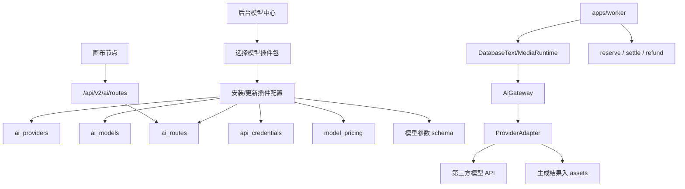

# AI Gateway 插件化改造超级详细开发计划

> 方案三目标：把当前分散的“服务商 Provider / 模型 Model / 线路 Route / 凭证 Credential / 价格 Pricing / Worker Adapter”改造成一套插件式 AI Gateway。后台不再靠手工拼字段来接模型，而是通过“模型插件包”完成安装、配置、测试、发布、监控和回滚。

---

## 0. 文档结论

当前项目已经有 AI 接入骨架，但还没有形成产品级配置体系。

现状是：

- 数据库已有 `ai_providers`、`ai_models`、`api_credentials`、`ai_routes`、`ai_call_logs`。
- 计费已有 `model_pricing`、`usage_events`、`billing_ledger`。
- Worker 已通过 `AiGateway` 注册 adapter，例如 `mock`、`openai-compatible`、`visionary-nano-banana`。
- 前端画布已经能从 `/api/v2/ai/routes?modality=image` 获取运行线路。
- 后台已有 `/api/v2/admin/ai/providers`、`/models`、`/routes`、`/pricing`、`/credentials` 等管理接口。

核心问题是：

- 后台配置方式仍然偏底层，用户要理解 provider、model、route、credential、pricing 才能配置。
- 前端模型、运行线路、后端 route 之间没有统一的“模型产品包”概念。
- `config/imageModels.json`、`config/imageRoutes.json`、数据库 seed、worker adapter 注册是分散维护的。
- 新模型接入没有标准清单、标准参数 schema、标准测试 endpoint、标准错误诊断。
- 线路选择虽然已经开始按模型过滤，但根因仍是模型与线路缺少强绑定的业务层。

本计划的最终状态：

```txt
后台模型中心
-> 选择插件包
-> 填 API Key / Base URL
-> 自动创建 provider / models / routes / pricing / UI 参数 schema
-> 一键测试
-> 发布到画布
-> 用户只看到“模型”和该模型可用的线路
-> Worker 根据 route 调用对应 adapter
-> 结果入 assets，计费 reserve/settle/refund 闭环
```

---

## 1. 改造边界

### 1.1 本计划要解决

- AI 模型后端接入混乱。
- 后台模型配置难用。
- 模型与运行线路逻辑混乱。
- 新增文本、生图、视频模型成本高。
- 缺少可复用的接入规范。
- 缺少真实接口测试、诊断、发布流程。
- 缺少插件包版本、启停、回滚、可观测。

### 1.2 本计划暂不解决

- 不重做整个 Flow 编排引擎。
- 不改变现有登录、项目、素材、账单主流程。
- 不把 API Key 暴露给前端。
- 不跳过现有 v2 runtime、worker、Redis/BullMQ、PostgreSQL 架构。
- 不一次性删除 legacy 代码。
- 不把第三方临时 URL 当成生成结果的长期来源，生成结果仍必须进入 `assets`。

---

## 2. 当前系统真实结构

### 2.1 数据库

相关迁移：

- `packages/db/migrations/000006_ai_gateway.sql`
- `packages/db/migrations/000007_workflow_runs.sql`
- `packages/db/migrations/000008_billing.sql`
- `packages/db/migrations/000012_billing_redeem_payments.sql`

已有 AI 表：

```txt
ai_providers
ai_models
api_credentials
ai_routes
ai_call_logs
model_pricing
```

已有工作流表：

```txt
workflow_runs
node_runs
workflow_run_events
```

已有资产与计费闭环：

```txt
assets
usage_events
billing_ledger
```

### 2.2 后端 API

已有管理接口：

```txt
GET  /api/v2/admin/ai/providers
POST /api/v2/admin/ai/providers
GET  /api/v2/admin/ai/models
POST /api/v2/admin/ai/models
GET  /api/v2/admin/ai/routes
POST /api/v2/admin/ai/routes
PATCH /api/v2/admin/ai/routes/:routeId
GET  /api/v2/admin/credentials
POST /api/v2/admin/credentials
POST /api/v2/admin/credentials/:credentialId/rotate
GET  /api/v2/admin/ai/pricing
PATCH /api/v2/admin/ai/pricing
GET  /api/v2/ai/routes
```

关键文件：

```txt
apps/api/src/modules/ai-gateway/ai-gateway.routes.ts
apps/api/src/modules/ai-gateway/ai-gateway.service.ts
apps/api/src/modules/ai-gateway/ai-gateway.schemas.ts
src/services/v2AiGatewayAdminApi.ts
src/services/v2AiRoutesApi.ts
```

### 2.3 Worker / Runtime

关键文件：

```txt
packages/ai-gateway-core/src/provider-adapter.ts
packages/ai-gateway-core/src/ai-gateway.ts
packages/ai-gateway-core/src/database-text-runtime.ts
packages/ai-gateway-core/src/database-media-runtime.ts
apps/worker/src/main.ts
apps/worker/src/workflow-runtime/service.ts
```

现有 adapter 形态：

```ts
export interface ProviderAdapter {
  generateText?(context, request): Promise<ProviderTextGenerationResult>;
  generateImage?(context, request): Promise<ProviderMediaGenerationResult>;
  generateVideo?(context, request): Promise<ProviderMediaGenerationResult>;
  pollTask?(context, request): Promise<ProviderTaskResult>;
}
```

Worker 当前注册方式：

```txt
mock
openai
openai-compatible
visionary-nano-banana
```

### 2.4 前端

关键文件：

```txt
src/account/ProviderSettingsPage.tsx
src/flowCanvas/nodes/FlowNodes.tsx
src/flowCanvas/utils/runtimeRouteOptions.ts
src/services/v2AiRoutesApi.ts
config/imageModels.json
config/imageRoutes.json
```

当前问题：

- `ProviderSettingsPage.tsx` 是底层配置表单，不是模型产品化配置。
- 页面里有中文乱码，需要后续统一修复。
- `config/imageModels.json` 是前端模型列表，数据库 `ai_models` 是后端模型列表，两套数据容易漂移。
- `config/imageRoutes.json` 是前端旧线路配置，数据库 `ai_routes` 是 v2 线路配置，两套概念并存。

---

## 3. 目标架构

### 3.1 核心概念

用“模型插件包”收束所有底层配置。

```txt
AI Plugin Package
├─ Provider 定义
├─ Adapter 类型
├─ 支持的模型列表
├─ 每个模型的参数 schema
├─ 默认线路模板
├─ 凭证字段要求
├─ 计费规则
├─ 测试用例
├─ 前端节点面板配置
└─ 版本与兼容性信息
```

### 3.2 目标关系图



### 3.3 用户看到的配置体验

后台不再先显示“服务商、模型、线路、价格”四个底层对象，而是显示：

```txt
模型中心
├─ 已安装模型
│  ├─ GPT-image-2
│  ├─ Nano Banana Pro
│  ├─ Nano Banana Pro Fast
│  ├─ 文本模型 A
│  └─ 视频模型 A
├─ 添加模型
│  ├─ 从官方插件库选择
│  ├─ 填 API Key
│  ├─ 选择 Base URL
│  ├─ 设置价格
│  ├─ 一键测试
│  └─ 发布到画布
├─ 线路健康
├─ 调用日志
└─ 计费规则
```

普通创作者在画布里看到：

```txt
模型：Nano Banana Pro
线路：Nano Banana Pro - Visionary 稳定线路

模型：GPT-image-2
线路：GPT-image-2 - 默认线路
线路：GPT-image-2 - 备用线路
```

不会再出现：

```txt
选择 Nano Banana Pro 后还能选 OpenAI / Mock 线路
```

---

## 4. 新增数据库设计

### 4.1 新增表：ai_plugin_packages

用途：存储系统可识别的插件包定义。插件包可以来自代码内置，也可以后续来自数据库导入。

```sql
CREATE TABLE IF NOT EXISTS ai_plugin_packages (
  id uuid PRIMARY KEY DEFAULT gen_random_uuid(),
  package_key text NOT NULL UNIQUE,
  display_name text NOT NULL,
  provider_key text NOT NULL,
  adapter_kind text NOT NULL,
  modality text NOT NULL,
  version text NOT NULL,
  status text NOT NULL DEFAULT 'active',
  manifest_json jsonb NOT NULL DEFAULT '{}'::jsonb,
  created_at timestamptz NOT NULL DEFAULT now(),
  updated_at timestamptz NOT NULL DEFAULT now()
);

CREATE INDEX IF NOT EXISTS ai_plugin_packages_modality_status_idx
  ON ai_plugin_packages (modality, status);
```

说明：

- `package_key` 例如 `visionary.nano-banana-pro`、`openai.gpt-image-2`。
- `adapter_kind` 必须对应 Worker 注册的 adapter。
- `manifest_json` 保存插件完整定义。
- 系统级数据不带 `tenant_id`，因为插件定义是公共模板。

### 4.2 新增表：tenant_ai_plugin_installs

用途：记录某个 tenant 安装了哪个插件包，以及安装状态。

```sql
CREATE TABLE IF NOT EXISTS tenant_ai_plugin_installs (
  id uuid PRIMARY KEY DEFAULT gen_random_uuid(),
  tenant_id uuid NOT NULL REFERENCES tenants(id),
  package_id uuid NOT NULL REFERENCES ai_plugin_packages(id),
  installed_version text NOT NULL,
  status text NOT NULL DEFAULT 'draft',
  provider_id uuid REFERENCES ai_providers(id),
  credential_id uuid REFERENCES api_credentials(id),
  metadata jsonb NOT NULL DEFAULT '{}'::jsonb,
  installed_by uuid REFERENCES users(id),
  published_at timestamptz,
  disabled_at timestamptz,
  created_at timestamptz NOT NULL DEFAULT now(),
  updated_at timestamptz NOT NULL DEFAULT now(),
  UNIQUE (tenant_id, package_id)
);

CREATE INDEX IF NOT EXISTS tenant_ai_plugin_installs_tenant_status_idx
  ON tenant_ai_plugin_installs (tenant_id, status);

ALTER TABLE tenant_ai_plugin_installs ENABLE ROW LEVEL SECURITY;
ALTER TABLE tenant_ai_plugin_installs FORCE ROW LEVEL SECURITY;

CREATE POLICY tenant_ai_plugin_installs_select_current_tenant
  ON tenant_ai_plugin_installs
  FOR SELECT
  USING (tenant_id = app.current_tenant_id());

CREATE POLICY tenant_ai_plugin_installs_insert_current_tenant
  ON tenant_ai_plugin_installs
  FOR INSERT
  WITH CHECK (tenant_id = app.current_tenant_id());

CREATE POLICY tenant_ai_plugin_installs_update_current_tenant
  ON tenant_ai_plugin_installs
  FOR UPDATE
  USING (tenant_id = app.current_tenant_id())
  WITH CHECK (tenant_id = app.current_tenant_id());
```

状态建议：

```txt
draft       已安装但未发布到画布
testing     正在测试
published   已发布
disabled    已停用
error       安装或测试失败
```

### 4.3 新增表：ai_model_catalog

用途：把“画布里用户选择的模型”产品化，不直接暴露底层 `ai_models`。

```sql
CREATE TABLE IF NOT EXISTS ai_model_catalog (
  id uuid PRIMARY KEY DEFAULT gen_random_uuid(),
  tenant_id uuid REFERENCES tenants(id),
  plugin_install_id uuid REFERENCES tenant_ai_plugin_installs(id),
  model_id uuid REFERENCES ai_models(id),
  model_key text NOT NULL,
  display_name text NOT NULL,
  modality text NOT NULL,
  model_family text NOT NULL,
  default_route_key text,
  ui_schema jsonb NOT NULL DEFAULT '{}'::jsonb,
  capabilities jsonb NOT NULL DEFAULT '{}'::jsonb,
  sort_order int NOT NULL DEFAULT 100,
  status text NOT NULL DEFAULT 'active',
  created_at timestamptz NOT NULL DEFAULT now(),
  updated_at timestamptz NOT NULL DEFAULT now()
);

CREATE INDEX IF NOT EXISTS ai_model_catalog_tenant_modality_idx
  ON ai_model_catalog (tenant_id, modality, status, sort_order);

CREATE UNIQUE INDEX IF NOT EXISTS ai_model_catalog_tenant_model_key_unique_idx
  ON ai_model_catalog (tenant_id, model_key)
  WHERE tenant_id IS NOT NULL;
```

说明：

- `ai_models` 是 provider 维度的技术模型。
- `ai_model_catalog` 是画布选择器里的产品模型。
- 前端后续从 `/api/v2/ai/model-catalog` 获取模型列表，逐步替代 `config/imageModels.json`。

### 4.4 新增表：ai_route_health_checks

用途：记录线路测试、健康检查、最近错误。

```sql
CREATE TABLE IF NOT EXISTS ai_route_health_checks (
  id uuid PRIMARY KEY DEFAULT gen_random_uuid(),
  tenant_id uuid NOT NULL REFERENCES tenants(id),
  route_id uuid NOT NULL REFERENCES ai_routes(id),
  status text NOT NULL,
  latency_ms int,
  request_summary jsonb NOT NULL DEFAULT '{}'::jsonb,
  response_summary jsonb NOT NULL DEFAULT '{}'::jsonb,
  error jsonb,
  checked_by uuid REFERENCES users(id),
  created_at timestamptz NOT NULL DEFAULT now()
);

CREATE INDEX IF NOT EXISTS ai_route_health_checks_route_created_idx
  ON ai_route_health_checks (tenant_id, route_id, created_at DESC);

ALTER TABLE ai_route_health_checks ENABLE ROW LEVEL SECURITY;
ALTER TABLE ai_route_health_checks FORCE ROW LEVEL SECURITY;

CREATE POLICY ai_route_health_checks_select_current_tenant
  ON ai_route_health_checks
  FOR SELECT
  USING (tenant_id = app.current_tenant_id());

CREATE POLICY ai_route_health_checks_insert_current_tenant
  ON ai_route_health_checks
  FOR INSERT
  WITH CHECK (tenant_id = app.current_tenant_id());
```

### 4.5 扩展 ai_routes

建议新增字段：

```sql
ALTER TABLE ai_routes
ADD COLUMN IF NOT EXISTS plugin_install_id uuid REFERENCES tenant_ai_plugin_installs(id),
ADD COLUMN IF NOT EXISTS model_family text,
ADD COLUMN IF NOT EXISTS route_label text,
ADD COLUMN IF NOT EXISTS environment text NOT NULL DEFAULT 'production';

CREATE INDEX IF NOT EXISTS ai_routes_tenant_model_family_idx
  ON ai_routes (tenant_id, modality, model_family, status);
```

目的：

- 模型选择后，只展示同 `model_family` 的线路。
- 例如 `model_family = nano-banana-pro` 只出现 Nano Banana Pro 的线路。
- `environment` 支持 `development`、`staging`、`production`，避免 Mock 路线混入生产。

---

## 5. 插件包 Manifest 规范

### 5.1 Manifest 顶层结构

```ts
type AiPluginManifest = {
  packageKey: string;
  displayName: string;
  description: string;
  version: string;
  modality: "text" | "image" | "video";
  provider: {
    key: string;
    name: string;
    kind: string;
    defaultBaseUrl: string;
    capabilities?: Record<string, unknown>;
  };
  credentials: {
    type: "bearer";
    envKeys?: string[];
    fields: Array<{
      key: string;
      label: string;
      secret: boolean;
      required: boolean;
      placeholder?: string;
    }>;
  };
  models: AiPluginModelManifest[];
  routes: AiPluginRouteManifest[];
  pricing: AiPluginPricingManifest[];
  tests: AiPluginTestManifest[];
};
```

### 5.2 Model Manifest

```ts
type AiPluginModelManifest = {
  modelKey: string;
  displayName: string;
  modelFamily: string;
  modality: "text" | "image" | "video";
  defaultRouteKey: string;
  capabilities: {
    supportsReferenceImages?: boolean;
    supportsImageEdit?: boolean;
    supportsStreaming?: boolean;
    supportedAspectRatios?: string[];
    supportedSizes?: string[];
    maxInputImages?: number;
    maxPromptLength?: number;
  };
  uiSchema: {
    panelLayout: "default" | "compact" | "nano-banana" | "video" | "text";
    fields: AiPluginUiField[];
  };
};
```

### 5.3 UI Field Manifest

```ts
type AiPluginUiField = {
  key: string;
  label: string;
  type: "text" | "textarea" | "select" | "boolean" | "number" | "slider";
  defaultValue?: unknown;
  required?: boolean;
  options?: Array<{ label: string; value: string | number | boolean }>;
  min?: number;
  max?: number;
  step?: number;
  visibleWhen?: Record<string, unknown>;
  mapsTo: "request.prompt" | "request.model" | "request.metadata" | "request.params";
};
```

### 5.4 Route Manifest

```ts
type AiPluginRouteManifest = {
  routeKey: string;
  routeLabel: string;
  modelFamily: string;
  modality: "text" | "image" | "video";
  modelKey: string;
  baseUrl?: string;
  path?: string;
  mode: "sync" | "async" | "stream";
  timeoutMs: number;
  priority: number;
  requestConfig: Record<string, unknown>;
  rateLimit?: Record<string, unknown>;
};
```

### 5.5 Pricing Manifest

```ts
type AiPluginPricingManifest = {
  provider: string;
  model: string;
  route: string;
  unit: "text_generation" | "image_generation" | "video_generation";
  unitCredits: number;
  minChargeCredits: number;
  metadata?: Record<string, unknown>;
};
```

### 5.6 Test Manifest

```ts
type AiPluginTestManifest = {
  key: string;
  label: string;
  routeKey: string;
  request: {
    prompt?: string;
    messages?: Array<{ role: "system" | "user" | "assistant"; content: string }>;
    metadata?: Record<string, unknown>;
  };
  expected: {
    status: "succeeded" | "waiting_provider";
    minOutputs?: number;
  };
};
```

---

## 6. 示例插件包

### 6.1 Nano Banana Pro / Fast

```json
{
  "packageKey": "visionary.nano-banana",
  "displayName": "Nano Banana Pro",
  "description": "Visionary Nano Banana Pro image generation",
  "version": "1.0.0",
  "modality": "image",
  "provider": {
    "key": "visionary",
    "name": "Visionary",
    "kind": "visionary-nano-banana",
    "defaultBaseUrl": "https://visionary.beer",
    "capabilities": {
      "supportsImageGeneration": true,
      "supportsReferenceImages": true,
      "timeoutMs": 300000
    }
  },
  "credentials": {
    "type": "bearer",
    "envKeys": ["VISIONARY_API_KEY"],
    "fields": [
      {
        "key": "apiKey",
        "label": "Visionary API Key",
        "secret": true,
        "required": true,
        "placeholder": "Bearer token"
      }
    ]
  },
  "models": [
    {
      "modelKey": "nano-banana-pro",
      "displayName": "Nano Banana Pro",
      "modelFamily": "nano-banana-pro",
      "modality": "image",
      "defaultRouteKey": "image.nano-banana-pro",
      "capabilities": {
        "supportsReferenceImages": true,
        "supportedAspectRatios": ["1:1", "16:9", "9:16", "21:9", "4:3", "3:4", "3:2", "2:3"],
        "supportedSizes": ["2K", "4K"],
        "maxInputImages": 9
      },
      "uiSchema": {
        "panelLayout": "nano-banana",
        "fields": [
          {
            "key": "aspectRatio",
            "label": "比例",
            "type": "select",
            "defaultValue": "1:1",
            "options": [
              { "label": "1:1", "value": "1:1" },
              { "label": "16:9", "value": "16:9" },
              { "label": "9:16", "value": "9:16" }
            ],
            "mapsTo": "request.metadata"
          },
          {
            "key": "imageSize",
            "label": "分辨率",
            "type": "select",
            "defaultValue": "2K",
            "options": [
              { "label": "2K 稳定线路", "value": "2K" },
              { "label": "4K 高清线路", "value": "4K" }
            ],
            "mapsTo": "request.metadata"
          },
          {
            "key": "optimizeChineseText",
            "label": "AI 增强中文",
            "type": "boolean",
            "defaultValue": false,
            "mapsTo": "request.metadata"
          }
        ]
      }
    },
    {
      "modelKey": "nano-banana-pro-fast",
      "displayName": "Nano Banana Pro Fast",
      "modelFamily": "nano-banana-pro-fast",
      "modality": "image",
      "defaultRouteKey": "image.nano-banana-pro-fast",
      "capabilities": {
        "supportsReferenceImages": true,
        "supportedAspectRatios": ["1:1", "16:9", "9:16", "21:9", "4:3", "3:4", "3:2", "2:3"],
        "supportedSizes": ["2K", "4K"],
        "maxInputImages": 9
      },
      "uiSchema": {
        "panelLayout": "nano-banana",
        "fields": []
      }
    }
  ],
  "routes": [
    {
      "routeKey": "image.nano-banana-pro",
      "routeLabel": "Visionary 稳定线路",
      "modelFamily": "nano-banana-pro",
      "modality": "image",
      "modelKey": "nano-banana-pro",
      "path": "/v1/api/nano-banana",
      "mode": "sync",
      "timeoutMs": 300000,
      "priority": 10,
      "requestConfig": {
        "path": "/v1/api/nano-banana",
        "replyType": "json"
      }
    },
    {
      "routeKey": "image.nano-banana-pro-fast",
      "routeLabel": "Visionary 快速线路",
      "modelFamily": "nano-banana-pro-fast",
      "modality": "image",
      "modelKey": "nano-banana-pro-fast",
      "path": "/v1/api/nano-banana",
      "mode": "sync",
      "timeoutMs": 300000,
      "priority": 10,
      "requestConfig": {
        "path": "/v1/api/nano-banana",
        "replyType": "json"
      }
    }
  ],
  "pricing": [
    {
      "provider": "visionary",
      "model": "nano-banana-pro",
      "route": "image.nano-banana-pro",
      "unit": "image_generation",
      "unitCredits": 24,
      "minChargeCredits": 24,
      "metadata": {
        "optimizeChineseTextExtraCredits": 8
      }
    },
    {
      "provider": "visionary",
      "model": "nano-banana-pro-fast",
      "route": "image.nano-banana-pro-fast",
      "unit": "image_generation",
      "unitCredits": 48,
      "minChargeCredits": 48
    }
  ],
  "tests": [
    {
      "key": "basic-image",
      "label": "基础生图测试",
      "routeKey": "image.nano-banana-pro",
      "request": {
        "prompt": "一张简洁的中文海报，白色背景，黑色标题：测试成功",
        "metadata": {
          "aspectRatio": "1:1",
          "imageSize": "2K",
          "optimizeChineseText": false
        }
      },
      "expected": {
        "status": "succeeded",
        "minOutputs": 1
      }
    }
  ]
}
```

### 6.2 GPT-image-2

```json
{
  "packageKey": "openai-compatible.gpt-image-2",
  "displayName": "GPT-image-2",
  "version": "1.0.0",
  "modality": "image",
  "provider": {
    "key": "openai-compatible",
    "name": "OpenAI Compatible",
    "kind": "openai-compatible",
    "defaultBaseUrl": "https://api.openai.com/v1"
  },
  "models": [
    {
      "modelKey": "gpt-image-2",
      "displayName": "GPT-image-2",
      "modelFamily": "gpt-image-2",
      "modality": "image",
      "defaultRouteKey": "image.gpt-image-2",
      "capabilities": {
        "supportsReferenceImages": true,
        "supportedSizes": ["auto", "1024x1024", "1024x1536", "1536x1024", "1K", "2K", "4K"]
      },
      "uiSchema": {
        "panelLayout": "default",
        "fields": []
      }
    }
  ],
  "notes": [
    "GPT-Image-2 provider payload size must be auto or a concrete pixel size. 1K/2K/4K are UI route/billing tiers only and must be converted with aspectRatio before provider calls."
  ],
  "routes": [
    {
      "routeKey": "image.gpt-image-2",
      "routeLabel": "默认线路",
      "modelFamily": "gpt-image-2",
      "modality": "image",
      "modelKey": "gpt-image-2",
      "mode": "sync",
      "timeoutMs": 300000,
      "priority": 10,
      "requestConfig": {
        "path": "/images/generations",
        "outputFormat": "png"
      }
    }
  ]
}
```

---

## 7. 后端模块设计

### 7.1 新增目录

```txt
apps/api/src/modules/ai-plugins/
  ai-plugins.routes.ts
  ai-plugins.service.ts
  ai-plugins.schemas.ts
  plugin-installer.ts
  plugin-manifest.ts

packages/ai-gateway-core/src/plugins/
  registry.ts
  manifests/
    visionary-nano-banana.ts
    openai-gpt-image-2.ts
    mock-local-dev.ts
```

### 7.2 插件服务职责

`AiPluginService` 负责：

- 列出可安装插件。
- 读取插件 manifest。
- 安装插件到当前 tenant。
- 更新插件版本。
- 禁用插件。
- 发布插件到画布。
- 生成 provider/model/route/pricing。
- 绑定或创建 credential。
- 测试 route。
- 写入 health check。

### 7.3 新增 API

```txt
GET  /api/v2/admin/ai/plugins
GET  /api/v2/admin/ai/plugins/:packageKey
POST /api/v2/admin/ai/plugins/:packageKey/install
POST /api/v2/admin/ai/plugins/:installId/publish
POST /api/v2/admin/ai/plugins/:installId/disable
POST /api/v2/admin/ai/plugins/:installId/credentials
POST /api/v2/admin/ai/routes/:routeId/test
GET  /api/v2/admin/ai/routes/:routeId/health
GET  /api/v2/ai/model-catalog
GET  /api/v2/ai/model-catalog/:modelKey/routes
```

### 7.4 API 返回示例

`GET /api/v2/ai/model-catalog?modality=image`

```json
[
  {
    "modelKey": "nano-banana-pro",
    "displayName": "Nano Banana Pro",
    "modality": "image",
    "modelFamily": "nano-banana-pro",
    "defaultRouteKey": "image.nano-banana-pro",
    "estimatedCredits": 24,
    "uiSchema": {
      "panelLayout": "nano-banana",
      "fields": []
    },
    "capabilities": {
      "supportsReferenceImages": true
    }
  }
]
```

`GET /api/v2/ai/model-catalog/nano-banana-pro/routes`

```json
[
  {
    "routeKey": "image.nano-banana-pro",
    "routeLabel": "Visionary 稳定线路",
    "modelKey": "nano-banana-pro",
    "modelFamily": "nano-banana-pro",
    "providerKey": "visionary",
    "providerName": "Visionary",
    "estimatedCredits": 24,
    "status": "active",
    "health": {
      "status": "ok",
      "lastCheckedAt": "2026-06-06T00:00:00.000Z",
      "latencyMs": 2400
    }
  }
]
```

### 7.5 安装插件事务

安装必须在一个 tenant transaction 内完成：

```txt
1. 校验权限 provider:manage / credential:manage
2. 校验 manifest schema
3. upsert ai_plugin_packages
4. upsert tenant_ai_plugin_installs
5. upsert ai_providers
6. 如传入 API Key，创建或轮换 api_credentials
7. upsert ai_models
8. upsert ai_routes
9. upsert model_pricing
10. upsert ai_model_catalog
11. 写 audit_log
12. 返回 install summary
```

### 7.6 安装接口输入

```ts
type InstallPluginInput = {
  credential?: {
    name?: string;
    secret?: string;
  };
  baseUrlOverride?: string | null;
  pricingOverrides?: Array<{
    modelKey: string;
    routeKey: string;
    minChargeCredits: number;
    unitCredits: number;
  }>;
  publishImmediately?: boolean;
};
```

### 7.7 安装接口输出

```ts
type InstallPluginResult = {
  installId: string;
  packageKey: string;
  status: "draft" | "published";
  provider: ProviderView;
  models: ModelView[];
  routes: RouteView[];
  catalogModels: Array<{
    modelKey: string;
    displayName: string;
    defaultRouteKey: string;
  }>;
  warnings: string[];
};
```

---

## 8. Adapter 改造设计

### 8.1 Adapter 不应该知道 UI

Adapter 只负责：

- 把统一请求转换为第三方请求。
- 调用第三方 API。
- 解析响应。
- 返回统一结果。
- 标准化错误。
- 支持异步任务轮询。

Adapter 不负责：

- 画布 UI。
- 价格。
- 权限。
- 凭证保存。
- route 选择。
- asset 入库。

### 8.2 标准错误码

统一使用：

```txt
ADAPTER_NOT_FOUND
ADAPTER_OPERATION_NOT_SUPPORTED
MODEL_REQUIRED
CREDENTIAL_REQUIRED
PROVIDER_BAD_REQUEST
PROVIDER_UNAUTHORIZED
PROVIDER_RATE_LIMITED
PROVIDER_TIMEOUT
PROVIDER_INTERNAL_ERROR
PROVIDER_RESULT_INVALID
PROVIDER_RESULT_UNKNOWN
```

### 8.3 Adapter 测试要求

每个 adapter 至少有：

```txt
1. 构造请求测试
2. 成功响应解析测试
3. 400 错误映射测试
4. 401/403 凭证错误映射测试
5. 429 限流错误映射测试
6. 500 上游错误映射测试
7. timeout 测试
8. secret redaction 测试
```

### 8.4 Worker 注册改造

当前在 `apps/worker/src/main.ts` 手写：

```ts
const aiGateway = new AiGateway({
  mock: new MockProviderAdapter(),
  openai: new OpenAiCompatibleTextAdapter(),
  "openai-compatible": new OpenAiCompatibleTextAdapter(),
  "visionary-nano-banana": new VisionaryNanoBananaAdapter(),
});
```

目标改成：

```ts
const aiGateway = createAiGatewayFromAdapterRegistry({
  enabledAdapters: env.enabledAiAdapters,
});
```

环境变量：

```txt
AI_ENABLED_ADAPTERS=openai-compatible,visionary-nano-banana
AI_ENABLE_MOCK_ADAPTER=false
```

生产默认禁用 mock。

---

## 9. 前端产品化设计

### 9.1 后台页面拆分

将当前 `ProviderSettingsPage.tsx` 拆成：

```txt
src/account/ai-settings/
  AiSettingsPage.tsx
  InstalledModelList.tsx
  PluginCatalogPanel.tsx
  PluginInstallWizard.tsx
  CredentialStep.tsx
  PricingStep.tsx
  RouteTestStep.tsx
  RouteHealthPanel.tsx
  AdvancedProviderRouteEditor.tsx
```

### 9.2 页面结构

```txt
模型中心
├─ 顶部状态
│  ├─ 已发布模型数
│  ├─ 可用线路数
│  ├─ 异常线路数
│  └─ 最近一次调用错误
├─ 已安装模型
│  ├─ 文本
│  ├─ 生图
│  └─ 视频
├─ 添加模型
│  ├─ 插件卡片
│  └─ 安装向导
├─ 线路健康
└─ 高级配置
```

### 9.3 安装向导

步骤：

```txt
1. 选择模型插件
2. 填服务凭证
3. 确认模型与线路
4. 设置扣费价格
5. 一键测试
6. 发布到画布
```

### 9.4 普通画布模型选择

前端节点应改为：

```txt
先选模型 catalog model
-> 根据 modelFamily 请求 route
-> 只显示该模型可用 route
-> 根据 uiSchema 渲染参数面板
-> 保存 node.data.modelKey / modelFamily / routeKey / params
```

节点数据建议：

```ts
type GenerationNodeData = {
  modelKey: string;
  modelFamily: string;
  routeKey: string;
  prompt: string;
  params: Record<string, unknown>;
  assetId?: string | null;
  generationStatus?: "idle" | "running" | "done" | "failed";
};
```

### 9.5 前端替换顺序

第一阶段保留 `config/imageModels.json` 作为 fallback。

最终目标：

```txt
GET /api/v2/ai/model-catalog
替代 config/imageModels.json

GET /api/v2/ai/model-catalog/:modelKey/routes
替代 config/imageRoutes.json
```

---

## 10. 计费改造

### 10.1 当前问题

当前 reserve 阶段有默认价格 fallback，不能完全反映用户选中的 provider/model/route。

目标：

```txt
workflow run 创建时
-> 解析编译后节点 config
-> 找到 modelKey / routeKey
-> 查询 ai_routes + ai_models + ai_providers
-> 查询 model_pricing 精确价格
-> reserve
```

### 10.2 价格优先级

```txt
1. provider + model + route + unit
2. provider + model + default + unit
3. provider + default + default + unit
4. default + default + default + unit
```

### 10.3 特殊价格

Nano Banana Pro：

```txt
基础成功扣 24 点
optimizeChineseText=true 额外 8 点
失败不扣最终额度
```

实现建议：

- reserve 阶段按最坏情况预估：32 点。
- settle 阶段按实际参数结算：24 或 32 点。
- 如果实际小于 reserve，settle 释放差额。

Nano Banana Pro Fast：

```txt
成功扣 48 点
失败不扣最终额度
```

### 10.4 需要补齐的服务

新增：

```txt
apps/api/src/modules/workflow-runs/workflow-pricing-resolver.ts
```

职责：

- 从 node config 获取 `modality`、`modelKey`、`routeKey`、`params`。
- 查询对应 provider/model/route。
- 根据 `model_pricing.metadata` 计算预估价格。
- 返回 reserve amount 和 pricing snapshot。

`node_runs.cost_json` 建议保存：

```json
{
  "reservedCents": 32,
  "reserveStatus": "reserved",
  "pricingSnapshot": {
    "provider": "visionary",
    "model": "nano-banana-pro",
    "route": "image.nano-banana-pro",
    "unit": "image_generation",
    "baseCredits": 24,
    "extras": [
      {
        "key": "optimizeChineseText",
        "credits": 8
      }
    ]
  }
}
```

---

## 11. 测试与诊断设计

### 11.1 一键测试 endpoint

```txt
POST /api/v2/admin/ai/routes/:routeId/test
```

输入：

```json
{
  "testKey": "basic-image",
  "dryRun": false,
  "requestOverride": {
    "prompt": "测试图片"
  }
}
```

输出：

```json
{
  "status": "succeeded",
  "routeId": "uuid",
  "routeKey": "image.nano-banana-pro",
  "providerKey": "visionary",
  "modelKey": "nano-banana-pro",
  "latencyMs": 2400,
  "outputs": [
    {
      "kind": "image",
      "url": "https://..."
    }
  ],
  "healthCheckId": "uuid"
}
```

错误输出：

```json
{
  "error": {
    "code": "PROVIDER_UNAUTHORIZED",
    "message": "服务商拒绝了当前 API Key",
    "diagnosis": "请检查后台凭证是否正确，或是否已过期。",
    "requestId": "..."
  }
}
```

### 11.2 诊断映射

后台显示中文解释：

```txt
PROVIDER_UNAUTHORIZED
-> API Key 无效、过期或没有该模型权限。

PROVIDER_RATE_LIMITED
-> 服务商限流，可稍后重试或切换线路。

PROVIDER_BAD_REQUEST
-> 请求参数不符合服务商要求，检查比例、尺寸、参考图数量。

PROVIDER_TIMEOUT
-> 请求超时，可能实际仍在服务商侧执行，需要进入未知结果核对。

PROVIDER_RESULT_INVALID
-> 服务商返回格式不符合 adapter 预期，需要检查 adapter。
```

### 11.3 日志红线

严禁日志出现：

```txt
原始 API Key
完整 Authorization header
base64 大图
用户隐私文件内容
支付密钥
```

必须允许日志出现：

```txt
providerKey
modelKey
routeKey
routeId
credential maskedSecret
requestId
traceId
latencyMs
error code
```

---

## 12. 迁移策略

### 12.1 第一阶段兼容现有数据

现有表继续可用：

```txt
ai_providers
ai_models
api_credentials
ai_routes
model_pricing
```

新增插件表只是给它们加上安装来源与产品层。

### 12.2 迁移现有 Nano Banana / GPT-image-2

写迁移脚本：

```txt
scripts/migrate-ai-routes-to-plugin-installs.ts
```

逻辑：

```txt
1. 找 provider.kind = visionary-nano-banana
2. 创建/更新 ai_plugin_packages visionary.nano-banana
3. 创建 tenant_ai_plugin_installs
4. 给相关 ai_routes 写 plugin_install_id/model_family/route_label
5. 创建 ai_model_catalog
6. 保留原 route_key 不变
```

GPT-image-2 同理。

### 12.3 Mock 路线处理

目标：

```txt
development 环境可以显示 mock
staging 默认隐藏 mock
production 禁止显示 mock
```

实现：

- `ai_routes.environment = development`
- `/api/v2/ai/routes` 根据服务端环境过滤。
- Worker 生产环境不注册 `mock` adapter。

### 12.4 前端配置迁移

分三步：

```txt
1. 新接口可用后，前端优先用 /api/v2/ai/model-catalog。
2. 接口失败时 fallback 到 config/imageModels.json。
3. 稳定后删除或只保留 config/imageModels.json 作为开发 fallback。
```

---

## 13. 开发阶段计划

### Phase 0：基线审计与保护

目标：先把当前问题固定下来，避免越改越乱。

任务：

- 梳理所有 provider/model/route/pricing/credential 相关文件。
- 标记生产不能出现的 mock route。
- 列出现有 seed 输出和数据库实际记录。
- 补一份当前 API 接入审计。
- 明确 `DEVELOPMENT_PLAN.md` 编码问题，暂不大改该文件。

文件：

```txt
docs/ai-provider-config-audit.md
docs/AI_GATEWAY_PLUGIN_DEVELOPMENT_PLAN.md
```

验收：

- 有清晰现状文档。
- 没有业务代码改动。
- 不影响当前部署。

预计工期：0.5 天。

---

### Phase 1：插件 Manifest 与内置注册表

目标：把 Nano Banana、GPT-image-2、Mock 先变成标准插件包定义。

任务：

- 新增 manifest 类型定义。
- 新增内置插件 registry。
- 把 `scripts/dev-seed-ai.ts` 中的硬编码配置抽取成 manifest。
- 增加 manifest schema 校验。
- 增加单测，确保 manifest 必填项完整。

新增文件：

```txt
packages/ai-gateway-core/src/plugins/plugin-manifest.ts
packages/ai-gateway-core/src/plugins/registry.ts
packages/ai-gateway-core/src/plugins/manifests/visionary-nano-banana.ts
packages/ai-gateway-core/src/plugins/manifests/openai-gpt-image-2.ts
packages/ai-gateway-core/src/plugins/manifests/mock-local-dev.ts
packages/ai-gateway-core/test/plugin-registry.test.ts
```

验收：

- `registry.get("visionary.nano-banana")` 能拿到完整 manifest。
- manifest 中 route/model/pricing 能覆盖当前 seed 的 Nano Banana Pro / Fast。
- `npm run build --workspace @aigc-flow/ai-gateway-core` 通过。
- `npm test --workspace @aigc-flow/ai-gateway-core` 通过。

预计工期：1 天。

---

### Phase 2：数据库迁移

目标：增加插件安装、模型目录、线路健康所需表。

任务：

- 新增 migration，例如 `000013_ai_plugin_packages.sql`。
- 建表：
  - `ai_plugin_packages`
  - `tenant_ai_plugin_installs`
  - `ai_model_catalog`
  - `ai_route_health_checks`
- 扩展 `ai_routes`：
  - `plugin_install_id`
  - `model_family`
  - `route_label`
  - `environment`
- 添加索引。
- 添加 RLS。
- 添加 db tests。

新增文件：

```txt
packages/db/migrations/000013_ai_plugin_packages.sql
packages/db/test/ai-plugin-packages.test.ts
```

验收：

- `npm run db:migrate` 本地通过。
- tenant A 看不到 tenant B 的 plugin installs / health checks / catalog models。
- 老数据不被破坏。
- `npm test --workspace @aigc-flow/db` 通过。

预计工期：1 天。

---

### Phase 3：插件安装服务与 API

目标：后台可以通过一个插件安装接口自动创建 provider/model/route/pricing。

任务：

- 新增 `apps/api/src/modules/ai-plugins`。
- 实现 `GET /api/v2/admin/ai/plugins`。
- 实现 `POST /api/v2/admin/ai/plugins/:packageKey/install`。
- 实现 `POST /api/v2/admin/ai/plugins/:installId/publish`。
- 实现 `POST /api/v2/admin/ai/plugins/:installId/disable`。
- 实现 credential 绑定/轮换。
- 写 audit log。
- 写 API 测试。

新增文件：

```txt
apps/api/src/modules/ai-plugins/ai-plugins.routes.ts
apps/api/src/modules/ai-plugins/ai-plugins.service.ts
apps/api/src/modules/ai-plugins/ai-plugins.schemas.ts
apps/api/src/modules/ai-plugins/plugin-installer.ts
apps/api/test/ai-plugins.test.ts
```

修改文件：

```txt
apps/api/src/app.ts
```

验收：

- 管理员安装 Nano Banana 插件后，数据库自动出现 provider/model/route/pricing/catalog。
- 未发布时画布不可见。
- 发布后 `/api/v2/ai/model-catalog` 可见。
- 禁用后画布不可见，历史 route 不硬删除。
- API Key 只进入 `api_credentials` 加密字段。

预计工期：2 天。

---

### Phase 4：模型目录和线路查询 API

目标：前端不再直接拼底层 route 列表，而是先拿模型，再拿该模型可用线路。

任务：

- 实现 `GET /api/v2/ai/model-catalog`。
- 实现 `GET /api/v2/ai/model-catalog/:modelKey/routes`。
- 路由查询必须按 `tenant_id`、`modality`、`model_family`、`status`、`environment` 过滤。
- 返回 `uiSchema`、`estimatedCredits`、`health`。
- 保留旧 `/api/v2/ai/routes` 一段时间兼容。

修改文件：

```txt
apps/api/src/modules/ai-gateway/ai-gateway.routes.ts
apps/api/src/modules/ai-gateway/ai-gateway.service.ts
apps/api/src/modules/ai-gateway/ai-gateway.schemas.ts
src/services/v2AiRoutesApi.ts
```

验收：

- 选择 `nano-banana-pro` 只返回 `model_family = nano-banana-pro` 的线路。
- 选择 `gpt-image-2` 只返回 `model_family = gpt-image-2` 的线路。
- 生产环境不返回 mock。
- 老接口仍可用，不影响当前画布。

预计工期：1.5 天。

---

### Phase 5：Route 一键测试与健康检查

目标：后台配置完后，不用上画布就能知道 API Key、Base URL、模型参数是否可用。

任务：

- 实现 `POST /api/v2/admin/ai/routes/:routeId/test`。
- 按 route modality 调用 text/image/video runtime。
- 不把测试结果长期写入用户素材库，除非用户点击“保存测试结果到素材”。
- 写入 `ai_route_health_checks`。
- 返回中文诊断。
- 前端显示最近测试状态。

修改文件：

```txt
apps/api/src/modules/ai-gateway/ai-gateway.routes.ts
apps/api/src/modules/ai-gateway/ai-gateway.service.ts
packages/ai-gateway-core/src/errors.ts
apps/api/test/ai-gateway-route-test.test.ts
```

验收：

- API Key 错误时返回清楚的 `PROVIDER_UNAUTHORIZED`。
- 参数错误时返回 `PROVIDER_BAD_REQUEST`。
- 成功时记录 latency。
- 测试过程不扣正式生成费用，或记录为 admin test usage，策略必须明确。

预计工期：1.5 天。

---

### Phase 6：Worker Adapter Registry 改造

目标：adapter 注册可配置，生产环境禁用 mock，新增 adapter 有标准入口。

任务：

- 新增 adapter registry。
- `apps/worker/src/main.ts` 改为从 registry 创建 `AiGateway`。
- 增加环境变量 `AI_ENABLED_ADAPTERS`。
- 增加生产环境 mock 保护。
- 确保 `visionary-nano-banana`、`openai-compatible` 正常注册。

新增文件：

```txt
packages/ai-gateway-core/src/adapter-registry.ts
packages/ai-gateway-core/test/adapter-registry.test.ts
```

修改文件：

```txt
apps/worker/src/main.ts
apps/worker/src/config/env.ts
```

验收：

- `AI_ENABLED_ADAPTERS=visionary-nano-banana` 时只启用 Visionary。
- route.provider.kind 找不到 adapter 时明确报 `ADAPTER_NOT_FOUND`。
- 生产环境即使数据库有 mock route，也不会执行 mock adapter。

预计工期：1 天。

---

### Phase 7：后台模型中心 UI 重构

目标：把现在底层表单式页面改成可用的模型配置中心。

任务：

- 新建 `src/account/ai-settings`。
- 保留高级配置入口，但默认展示产品化模型中心。
- 实现插件卡片。
- 实现安装向导。
- 实现凭证输入与轮换。
- 实现价格设置。
- 实现一键测试。
- 实现发布/停用。
- 修复当前中文乱码。

新增文件：

```txt
src/account/ai-settings/AiSettingsPage.tsx
src/account/ai-settings/PluginCatalogPanel.tsx
src/account/ai-settings/PluginInstallWizard.tsx
src/account/ai-settings/InstalledModelList.tsx
src/account/ai-settings/RouteTestStep.tsx
src/account/ai-settings/RouteHealthPanel.tsx
src/account/ai-settings/aiPluginAdminApi.ts
```

修改文件：

```txt
src/account/ProviderSettingsPage.tsx
src/account/AccountPage.tsx
src/services/v2AiGatewayAdminApi.ts
```

验收：

- 后台可以不手写 routeKey 完成 Nano Banana 安装。
- 后台可以不手写 provider.kind 完成 GPT-image-2 安装。
- 测试成功后才能发布，或发布时明确提示未测试。
- 页面中文全部正常。
- 没有 API Key 明文回显。

预计工期：2.5 天。

---

### Phase 8：画布模型选择器改造

目标：彻底解决“上面选 A 模型，下面能选 B 线路”的混乱。

任务：

- 新增 `listModelCatalog` 前端 API。
- 新增 `listRoutesForModel` 前端 API。
- FlowNodes 中模型选择改为 catalog 驱动。
- route 选择由 `modelFamily` 过滤。
- 参数面板由 `uiSchema` 渲染。
- 保留 config fallback。
- 写前端测试。

修改文件：

```txt
src/services/v2AiRoutesApi.ts
src/flowCanvas/nodes/FlowNodes.tsx
src/flowCanvas/utils/runtimeRouteOptions.ts
src/flowCanvas/runtime/v2WorkflowRunner.ts
```

可能新增：

```txt
src/services/v2AiModelCatalogApi.ts
src/flowCanvas/utils/modelCatalogOptions.ts
src/flowCanvas/nodes/DynamicModelParamsPanel.tsx
```

验收：

- 选 Nano Banana Pro，只能看到 Nano Banana Pro 线路。
- 选 Nano Banana Pro Fast，只能看到 Fast 线路。
- 选 GPT-image-2，只能看到 GPT-image-2 线路。
- 切换模型时，如果原 route 不属于新模型，自动切换到新模型默认 route。
- 节点保存 `modelKey`、`modelFamily`、`routeKey`、`params`。

预计工期：2 天。

---

### Phase 9：精确计费与 reserve/settle 对齐

目标：按实际选择的模型和线路预估扣费，不再依赖 default/default/default。

任务：

- 新增 workflow pricing resolver。
- workflow run 创建时读取 compiled node config。
- 精确匹配 route/model/provider/pricing。
- 支持 metadata extras。
- settle 时按实际结果和参数重算费用。
- 如果实际费用低于 reserve，释放差额。
- 写 billing tests。

新增文件：

```txt
apps/api/src/modules/workflow-runs/workflow-pricing-resolver.ts
apps/api/test/workflow-pricing-resolver-plugin.test.ts
```

修改文件：

```txt
apps/api/src/modules/workflow-runs/workflow-runs.service.ts
apps/worker/src/workflow-runtime/service.ts
```

验收：

- Nano Banana Pro 普通模式 reserve/settle 24。
- Nano Banana Pro AI 增强 reserve/settle 32。
- Nano Banana Pro Fast reserve/settle 48。
- 失败 refund。
- worker 重试不重复扣费。

预计工期：2 天。

---

### Phase 10：迁移脚本和部署文档

目标：把现有数据平滑迁移到插件体系，服务器更新可重复执行。

任务：

- 写现有 route 到 plugin install 的迁移脚本。
- 写 staging runbook。
- 更新 Docker Compose env 模板。
- 增加生产迁移命令说明，使用 dist CLI。
- 增加回滚步骤。

新增或修改：

```txt
scripts/migrate-ai-routes-to-plugin-installs.ts
docs/staging-runbook.md
docs/PRODUCTION_DEPLOYMENT.md
docs/STAGING_ENV_TEMPLATE.md
docker-compose.staging.yml
```

验收：

- 现有 Nano Banana / GPT-image-2 路线迁移后仍可用。
- 服务器执行脚本可重复，不重复创建数据。
- env 文件明确包含模型 API Key，但不进 git。
- rollback 能将新 catalog 暂停，保留旧 routes。

预计工期：1 天。

---

### Phase 11：端到端 QA

目标：用真实服务商跑通主链路。

### 11.1 Nano Banana Pro QA

```txt
1. 后台安装 Visionary Nano Banana 插件。
2. 填 VISIONARY API Key。
3. 测试 Nano Banana Pro。
4. 测试 Nano Banana Pro Fast。
5. 发布。
6. 进入画布。
7. 选择 Nano Banana Pro。
8. 确认线路只有 Nano Banana Pro 相关线路。
9. 生成图片。
10. 检查 workflow_run 成功。
11. 检查 node_run output 有 assetId。
12. 检查 /assets 有生成图片。
13. 检查 billing ledger settle。
```

### 11.2 GPT-image-2 QA

```txt
1. 后台安装 GPT-image-2 插件。
2. 填 OpenAI-compatible API Key 和 Base URL。
3. 一键测试。
4. 发布。
5. 进入画布。
6. 选择 GPT-image-2。
7. 确认线路只有 GPT-image-2。
8. 生成图片。
9. 检查 assets 和 billing。
```

### 11.3 错误 QA

```txt
1. 填错误 API Key，应该返回 PROVIDER_UNAUTHORIZED。
2. 填错误 Base URL，应该返回连接失败诊断。
3. 禁用 route，画布不显示该 route。
4. 禁用 plugin install，画布不显示该模型。
5. 余额不足，workflow run 创建失败且不进 worker。
6. 服务商 500，worker refund。
```

---

## 14. 推荐任务拆分

建议按小 PR/小提交推进：

```txt
1. ai-plugin-manifest-registry
2. ai-plugin-db-schema
3. ai-plugin-install-api
4. ai-model-catalog-runtime-api
5. ai-route-test-health
6. ai-adapter-registry-worker
7. ai-settings-admin-ui
8. flow-model-catalog-selector
9. workflow-pricing-route-aware
10. ai-plugin-migration-runbook
```

每个 PR 必须能独立 build。

---

## 15. 验收总标准

功能标准：

- 后台能通过插件安装 Nano Banana Pro / Fast。
- 后台能通过插件安装 GPT-image-2。
- 后台能一键测试线路。
- 画布模型和线路严格绑定。
- Mock 不进入生产可选线路。
- 新模型接入只需要新增 manifest 和 adapter，绝大部分无需改 UI。
- 生成成功后结果进入 `assets`。
- 计费按模型、线路、参数正确 reserve/settle/refund。

安全标准：

- API Key 不进入前端响应。
- API Key 不进入日志。
- credentials 加密保存。
- tenant 数据隔离。
- 后台操作有权限控制。
- 插件安装有 audit log。

技术标准：

- `npm run build` 通过。
- 相关 workspace 测试通过。
- 数据库 migration 可重复执行。
- 服务器部署步骤有文档。
- 失败可以回滚到旧 route 查询逻辑。

---

## 16. 风险与应对

### 16.1 风险：一次改太大

应对：

- 先做 manifest 和插件安装 API。
- 保留旧 `/api/v2/ai/routes`。
- 前端先 fallback 到 JSON。
- 最后再切默认路径。

### 16.2 风险：计费和插件同时改导致账单错误

应对：

- Phase 9 单独做。
- 新增 pricing snapshot。
- 每个 node_run 保存 reserve/settle/refund 状态。
- 先在 staging 用小额度测试。

### 16.3 风险：服务商 API 差异大

应对：

- Adapter 只处理 provider 差异。
- Manifest 只描述模型、参数、线路、价格。
- 不在前端写 provider 特殊逻辑。

### 16.4 风险：前端配置与后端配置漂移

应对：

- `/api/v2/ai/model-catalog` 成为权威来源。
- `config/imageModels.json` 只做开发 fallback。
- 插件 manifest 同时生成后端 catalog 和前端 uiSchema。

### 16.5 风险：生产误启 Mock

应对：

- `AI_ENABLE_MOCK_ADAPTER=false` 默认。
- route.environment 过滤。
- Worker 生产环境拒绝注册 mock。
- API 返回时过滤 mock。

---

## 17. 预估排期

如果每天集中开发：

```txt
Phase 0  基线审计                         0.5 天
Phase 1  Manifest 与 Registry             1 天
Phase 2  数据库迁移                        1 天
Phase 3  插件安装 API                      2 天
Phase 4  模型目录与线路 API                 1.5 天
Phase 5  Route 测试与健康检查               1.5 天
Phase 6  Worker Adapter Registry           1 天
Phase 7  后台模型中心 UI                    2.5 天
Phase 8  画布模型选择器                     2 天
Phase 9  精确计费                           2 天
Phase 10 迁移脚本与部署文档                  1 天
Phase 11 端到端 QA                          1 天
```

总计约 17 天。若只先支持生图模型，压缩到约 8 到 10 天。

---

## 18. 第一轮实施建议

第一轮不直接重做全部后台 UI，先做能稳定接模型的后端底座：

```txt
1. Phase 1：Manifest 与内置插件 registry
2. Phase 2：数据库迁移
3. Phase 3：插件安装 API
4. Phase 4：模型目录与线路 API
5. Phase 5：Route 一键测试
```

第一轮完成后，后台即使 UI 还不完美，也可以通过 API 或简单页面做到：

```txt
安装模型插件
-> 填 key
-> 自动建模型和线路
-> 测试线路
-> 发布到画布
```

这会先解决后端 API 接入混乱的根因，再进入 UI 重构。
