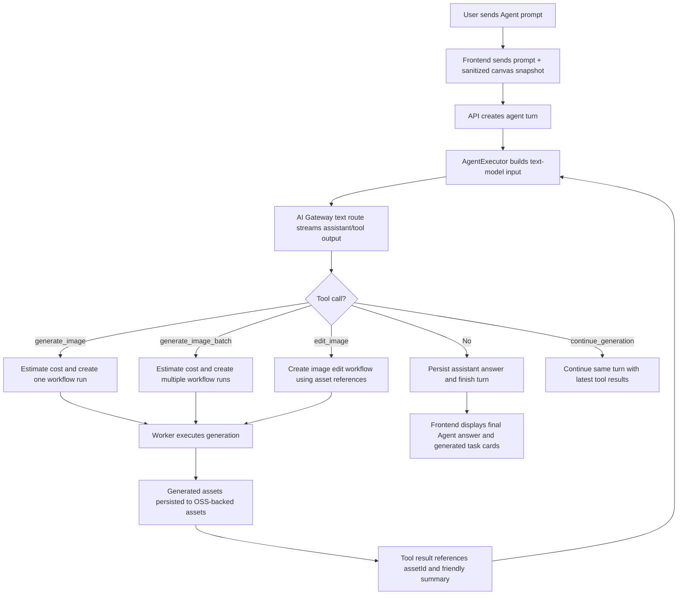

# Agent Tool-Calling Executor Upgrade Plan

> **For agentic workers:** REQUIRED SUB-SKILL: Use superpowers:subagent-driven-development (recommended) or superpowers:executing-plans to implement this plan task-by-task. Steps use checkbox (`- [ ]`) syntax for tracking.

**Goal:** Upgrade the current Canvas Agent from a JSON planner into a real production executor where the text model acts as the brain, calls image/video/workflow tools, observes generated assets, and continues the same turn until the production goal is complete or a safety limit is reached.

**Architecture:** Keep TapFlow's v2 server-side product architecture. The frontend remains a confirmation and progress surface; the API owns Agent sessions, tool-call loops, workflow launch, billing-safe execution, and asset references. Generated media still flows through existing workflow runs, worker execution, billing reserve/settle/refund, and OSS-backed `assets`; Agent never stores long-lived data URLs or exposes provider/baseUrl/API key/raw route/upstream model details to users.

**Tech Stack:** Vite + React 19, TypeScript, Zustand canvas store, `@xyflow/react`, Fastify API, Postgres/RLS migrations in `packages/db`, `packages/ai-gateway-core` text runtime, existing workflow-run APIs/services, Redis/BullMQ worker path, Vitest.

---

## Why This Upgrade

The current TapFlow Agent can ask the text model for a `CanvasAgentPlannerOutput`, show a plan, and apply approved canvas ops. That is safe, but it feels weak because the model does not truly operate tools or observe results.

The reference project `D:\gpt-iamge-2` uses a stronger pattern:

```txt
User prompt
-> text model streams a response
-> text model calls tools such as generate_image and generate_image_batch
-> the app executes real generation tasks
-> generated images are attached back to the model as references
-> the model continues the same turn when more work is needed
```

TapFlow should adopt that product behavior while keeping our stronger backend boundary:

```txt
User prompt
-> API Agent executor calls AI Gateway text route
-> model emits safe tool calls
-> API maps tool calls to workflow runs / assets / canvas ops
-> worker performs generation through existing providers
-> API streams progress and asset references to frontend
-> model receives sanitized tool results and continues
```

## Product Outcome

After this upgrade, users should be able to ask things like:

```txt
先生成一张统一风格的电商主视觉，再基于这张图做 4 张小红书封面，风格保持一致。
```

Expected Agent behavior:

```txt
1. Explain the production approach briefly.
2. Call generate_image for the base visual.
3. Wait for the real workflow result.
4. Attach the generated asset as a reference.
5. Call generate_image_batch for the 4 derived covers.
6. Show each generated task and result as it progresses.
7. Finish with a short summary and next-step suggestions.
```

This is not a free-form chatbot. It is a controlled production executor.

## Non-Negotiable Constraints

- No direct provider calls from the browser.
- No raw API keys, encrypted secrets, Authorization headers, provider internals, base URLs, raw route keys, or upstream model names in creator-facing UI.
- No generated media blobs, base64 strings, data URLs, or long-lived signed URLs persisted in canvas draft JSON or Agent memory.
- All media generation must use the existing v2 workflow/billing/assets path unless a future task explicitly changes that with approval.
- Missing pricing must fail closed.
- Credit-consuming tool calls require budget estimation and a user-visible confirmation boundary.
- Destructive canvas actions remain confirmed writes.
- Each Agent turn has strict limits for tool-call rounds, total generated items, total estimated credits, and elapsed runtime.
- Agent result references use `assetId`, node ids, workflow run ids, and friendly labels.

## Relationship To Existing Plans

This plan sits between:

- First-stage Agent plan: `docs/superpowers/plans/2026-06-16-canvas-agent-implementation.md`
- Final-stage Agent plan: `docs/superpowers/plans/2026-06-16-canvas-agent-final-stage-implementation.md`

The first stage created the panel, session tables, planner output, and confirmed canvas ops. This plan upgrades the Agent brain and execution loop. The final-stage plan can then build memory, recipes, governance, and advanced automation on top of a real tool-using executor.

## Target Flow



## Core Concepts

### Agent Executor

`AgentExecutorService` is the new orchestrator for a turn. It:

- Builds model input from user prompt, canvas snapshot, previous turn messages, and safe asset summaries.
- Calls the configured text route through `DatabaseTextGenerationRuntime`.
- Parses tool calls from model output.
- Validates each tool call against the tool schema and safety policy.
- Estimates cost before running generation tools.
- Executes tools through server-side workflow services.
- Streams progress events to the frontend.
- Feeds tool results back into the text model for the next round.
- Stops when the model returns final text or a safety limit is reached.

### Agent Tools

Initial tool set:

```ts
type AgentToolName =
  | "generate_image"
  | "generate_image_batch"
  | "edit_image"
  | "create_canvas_nodes"
  | "update_canvas_node"
  | "run_canvas_node"
  | "continue_generation";
```

First implementation priority:

```txt
generate_image
generate_image_batch
continue_generation
```

Second implementation priority:

```txt
edit_image
create_canvas_nodes
run_canvas_node
```

Video tools are deferred until image tools are stable:

```txt
generate_video
image_to_video
```

### Tool Result References

The text model never receives raw signed URLs. It receives safe references:

```json
{
  "toolCallId": "tool_123",
  "status": "succeeded",
  "assetRefs": [
    {
      "refId": "round-2-image-1",
      "assetId": "asset_uuid",
      "kind": "image",
      "label": "第 2 轮图 1",
      "promptSummary": "电商主视觉，暖色调，产品居中",
      "width": 2048,
      "height": 2048
    }
  ]
}
```

When image understanding is needed, a later task may attach temporary signed read URLs to the text runtime only on the server side. Those URLs must not be persisted or returned to the frontend.

## File Structure

### Database Migrations

- Create: `packages/db/migrations/000025_agent_tool_calls.sql`
  - Adds normalized tool-call records, workflow links, asset refs, cost estimates, and model loop metadata.

Expected tables:

```sql
CREATE TABLE agent_tool_calls (
  id uuid PRIMARY KEY DEFAULT gen_random_uuid(),
  tenant_id uuid NOT NULL REFERENCES tenants(id),
  session_id uuid NOT NULL REFERENCES agent_sessions(id),
  turn_id uuid NOT NULL REFERENCES agent_turns(id),
  parent_tool_call_id uuid NULL REFERENCES agent_tool_calls(id),
  tool_call_key text NOT NULL,
  tool_name text NOT NULL,
  status text NOT NULL CHECK (status IN ('planned', 'awaiting_approval', 'running', 'succeeded', 'failed', 'cancelled', 'skipped')),
  arguments_json jsonb NOT NULL DEFAULT '{}'::jsonb,
  result_json jsonb NOT NULL DEFAULT '{}'::jsonb,
  error_json jsonb NOT NULL DEFAULT '{}'::jsonb,
  cost_estimate_json jsonb NOT NULL DEFAULT '{}'::jsonb,
  workflow_run_id uuid NULL,
  node_run_id uuid NULL,
  created_by uuid NULL REFERENCES users(id),
  started_at timestamptz NULL,
  finished_at timestamptz NULL,
  created_at timestamptz NOT NULL DEFAULT now(),
  updated_at timestamptz NOT NULL DEFAULT now()
);

CREATE INDEX agent_tool_calls_tenant_turn_idx ON agent_tool_calls (tenant_id, turn_id, created_at);
CREATE INDEX agent_tool_calls_workflow_run_idx ON agent_tool_calls (workflow_run_id);
```

- Modify if needed: `packages/db/migrations/000024_agent_sessions.sql`
  - Do not rewrite history if already deployed. Add a new migration for any missing fields instead.

### Backend Files To Create

- `apps/api/src/modules/agent/agent-executor.service.ts`
  - Main tool-calling loop.
- `apps/api/src/modules/agent/agent-tool-schemas.ts`
  - Zod schemas for tool call arguments and results.
- `apps/api/src/modules/agent/agent-tool-registry.ts`
  - Declares available tools and converts them into text-model tool instructions.
- `apps/api/src/modules/agent/agent-tool-policy.ts`
  - Validates tool permission, credit limits, item limits, and route/model visibility.
- `apps/api/src/modules/agent/agent-tool-runner.ts`
  - Executes validated tools through workflow/canvas services.
- `apps/api/src/modules/agent/agent-tool-context.ts`
  - Builds continuation input after each tool result.
- `apps/api/src/modules/agent/agent-tool-events.ts`
  - SSE event helpers for thinking, tool_started, tool_progress, tool_result, message_delta, done, error.
- `apps/api/src/modules/agent/agent-asset-references.ts`
  - Converts asset ids and workflow outputs into safe model/frontend refs.
- `apps/api/src/modules/agent/agent-cost-estimator.ts`
  - Uses route/model pricing to estimate generation cost before execution.
- `apps/api/src/modules/agent/agent-workflow-launcher.ts`
  - Small adapter over existing workflow-run service for Agent-created target workflows.

### Backend Files To Modify

- `apps/api/src/modules/agent/agent.service.ts`
  - Delegate turn execution to `AgentExecutorService`.
  - Keep deterministic planner only as a fallback/debug mode, not the main production path.
- `apps/api/src/modules/agent/agent.routes.ts`
  - Add `/api/v2/agent/sessions/:sessionId/turns/execute/stream`.
  - Keep existing `/turns` and `/turns/stream` compatible during rollout.
- `apps/api/src/modules/agent/agent.schemas.ts`
  - Add executor request/response/event schemas.
- `apps/api/src/config/env.ts`
  - Add executor limits and feature flags.
- `apps/api/src/app.ts`
  - Register new services.
- `apps/api/src/fastify.d.ts`
  - Add service types.
- `apps/api/src/modules/workflow-runs/workflow-runs.service.ts`
  - Expose a narrow server-side method for Agent-generated workflow runs if no clean adapter exists.

### Frontend Files To Create

- `src/flowCanvas/agent/canvasAgentToolTypes.ts`
  - Tool event and tool card view types.
- `src/flowCanvas/agent/canvasAgentToolEvents.ts`
  - SSE parser for executor events.
- `src/flowCanvas/agent/CanvasAgentToolTimeline.tsx`
  - Displays streaming text, tool calls, task progress, and generated assets.
- `src/flowCanvas/agent/CanvasAgentToolCard.tsx`
  - One card per tool call with status, friendly label, progress, cost, and outputs.
- `src/flowCanvas/agent/CanvasAgentAssetRefStrip.tsx`
  - Shows generated image/video refs without internal route/provider details.

### Frontend Files To Modify

- `src/flowCanvas/agent/canvasAgentApi.ts`
  - Add `executeAgentTurnStream`.
- `src/flowCanvas/agent/useCanvasAgentSession.ts`
  - Move from plan-only state to executor state:
    - `thinking`
    - `awaiting_approval`
    - `executing_tool`
    - `continuing`
    - `completed`
    - `error`
- `src/flowCanvas/agent/CanvasAgentPanel.tsx`
  - Replace plan-only conversation view with streaming tool timeline.
- `src/flowCanvas/agent/CanvasAgentPlanCard.tsx`
  - Keep for canvas-op approvals, but generation tool approvals should use tool cards.
- `src/flowCanvas/agent/canvasAgentTypes.ts`
  - Add references from messages to tool calls and generated assets.
- `src/flowCanvas/canvas/AiFlowCanvas.tsx`
  - No major UI move required; keep Agent entry stable.

### Tests To Create Or Modify

- `apps/api/test/agent-executor.test.ts`
- `apps/api/test/agent-tool-schemas.test.ts`
- `apps/api/test/agent-tool-policy.test.ts`
- `apps/api/test/agent-tool-runner.test.ts`
- `apps/api/test/agent-asset-references.test.ts`
- `apps/api/test/agent-cost-estimator.test.ts`
- `packages/db/test/agent-tool-calls.test.ts`
- `src/flowCanvas/agent/canvasAgentToolEvents.test.ts`
- `src/flowCanvas/agent/useCanvasAgentSession.test.tsx`
- `src/flowCanvas/agent/CanvasAgentToolTimeline.test.tsx`
- `src/flowCanvas/agent/CanvasAgentPanel.test.tsx`

## Environment Variables

Add to `apps/api/src/config/env.ts`, `docker-compose.staging.yml`, and `docs/STAGING_ENV_TEMPLATE.md`:

```txt
AGENT_EXECUTOR_ENABLED=false
AGENT_EXECUTOR_REQUIRE_APPROVAL=true
AGENT_EXECUTOR_MAX_TOOL_ROUNDS=8
AGENT_EXECUTOR_MAX_GENERATED_ITEMS=8
AGENT_EXECUTOR_MAX_ESTIMATED_CREDITS=50
AGENT_EXECUTOR_TURN_TIMEOUT_MS=300000
AGENT_EXECUTOR_TOOL_TIMEOUT_MS=180000
AGENT_EXECUTOR_ALLOW_BATCH_IMAGE=true
AGENT_EXECUTOR_ALLOW_IMAGE_EDIT=false
AGENT_EXECUTOR_ALLOW_VIDEO=false
```

Keep existing:

```txt
AGENT_PLANNER_ENABLED
AGENT_TEXT_ROUTE_KEY
AGENT_PLANNER_REPAIR_ATTEMPTS
AGENT_PLANNER_TIMEOUT_MS
```

Rollout rule:

```txt
AGENT_EXECUTOR_ENABLED=false keeps current planner behavior.
AGENT_EXECUTOR_ENABLED=true enables the new tool-calling route for selected environments.
```

## Tool Schemas

### `generate_image`

```ts
export const generateImageToolArgsSchema = z.object({
  id: z.string().trim().min(1).max(80).optional(),
  prompt: z.string().trim().min(1).max(4000),
  modelDisplayName: z.string().trim().max(120).optional(),
  routeLabel: z.string().trim().max(120).optional(),
  size: z.enum(["1K", "2K", "4K"]).optional(),
  referenceRefs: z.array(z.string().trim().min(1).max(120)).max(8).optional(),
});
```

Policy:

- If `modelDisplayName` or `routeLabel` is absent, use the current product default image model and route.
- The model may request friendly names only.
- Backend maps friendly names to active product model/route records.
- If mapping fails, return a safe tool error and let the model ask the user to choose.

### `generate_image_batch`

```ts
export const generateImageBatchToolArgsSchema = z.object({
  images: z.array(
    z.object({
      id: z.string().trim().min(1).max(80).optional(),
      prompt: z.string().trim().min(1).max(4000),
      size: z.enum(["1K", "2K", "4K"]).optional(),
      referenceRefs: z.array(z.string().trim().min(1).max(120)).max(8).optional(),
    }),
  ).min(2).max(8),
  sharedStyle: z.string().trim().max(1000).optional(),
});
```

Policy:

- Estimate total cost before execution.
- Create all visible tool cards before launching network work.
- Execute with bounded server concurrency.
- Partial failures should not fail the whole Agent turn if at least one item succeeds.

### `continue_generation`

```ts
export const continueGenerationToolArgsSchema = z.object({
  reason: z.string().trim().min(1).max(1000),
});
```

Policy:

- Only valid after at least one successful generation tool result in the current turn.
- Counts toward `AGENT_EXECUTOR_MAX_TOOL_ROUNDS`.

## Model Prompt Contract

Create `apps/api/src/modules/agent/agent-executor-prompt.ts`.

Core instruction themes:

```txt
You are TapFlow Agent, a production assistant for an AI image/video canvas.

You can use tools to generate images and continue production work.
Use tools only when the user asks for production output.
Use generate_image for one required image.
Use generate_image_batch when multiple images are independent and can run in parallel.
When images depend on an earlier output, generate the base image first, then continue.
Never expose provider names, route keys, base URLs, API paths, API keys, adapter kinds, or upstream model names.
Refer to generated assets by friendly labels such as 第 1 张图 or 主视觉.
If tool output fails, explain the failure in user-safe language and suggest a repair.
Stop when the user goal is complete.
```

## Implementation Tasks

### Task 1: Add Agent Tool-Call Persistence

**Files:**

- Create: `packages/db/migrations/000025_agent_tool_calls.sql`
- Create/modify test: `packages/db/test/agent-tool-calls.test.ts`

- [ ] Add migration with `agent_tool_calls`.
- [ ] Add tenant-scoped indexes.
- [ ] Add RLS policies using the existing tenant context pattern.
- [ ] Add test that tenant A cannot read tenant B tool calls.
- [ ] Run:

```bash
npm run test --workspace @aigc-flow/db -- agent-tool-calls.test.ts
npm run build --workspace @aigc-flow/db
```

- [ ] Commit:

```bash
git add packages/db/migrations/000025_agent_tool_calls.sql packages/db/test/agent-tool-calls.test.ts
git commit -m "feat: persist agent tool calls"
```

### Task 2: Define Tool Schemas And Policy

**Files:**

- Create: `apps/api/src/modules/agent/agent-tool-schemas.ts`
- Create: `apps/api/src/modules/agent/agent-tool-policy.ts`
- Test: `apps/api/test/agent-tool-schemas.test.ts`
- Test: `apps/api/test/agent-tool-policy.test.ts`

- [ ] Add Zod schemas for `generate_image`, `generate_image_batch`, and `continue_generation`.
- [ ] Add policy checks for max tool rounds, max generated items, max estimated credits, approval requirement, and allowed modalities.
- [ ] Add redaction checks that reject internal provider fields in tool args.
- [ ] Add tests for valid single image, valid batch, too many batch items, internal field rejection, and disabled tool rejection.
- [ ] Run:

```bash
npm run test --workspace @aigc-flow/api -- agent-tool-schemas.test.ts agent-tool-policy.test.ts
```

- [ ] Commit:

```bash
git add apps/api/src/modules/agent/agent-tool-schemas.ts apps/api/src/modules/agent/agent-tool-policy.ts apps/api/test/agent-tool-schemas.test.ts apps/api/test/agent-tool-policy.test.ts
git commit -m "feat: define agent tool schemas and policy"
```

### Task 3: Build Safe Asset Reference Helpers

**Files:**

- Create: `apps/api/src/modules/agent/agent-asset-references.ts`
- Test: `apps/api/test/agent-asset-references.test.ts`

- [ ] Convert workflow output assets to safe refs with `refId`, `assetId`, `kind`, `label`, dimensions, and prompt summary.
- [ ] Do not include signed URLs, base URLs, provider values, route keys, or upstream models.
- [ ] Add helper to build continuation context from successful refs.
- [ ] Add tests for redaction and stable ref numbering.
- [ ] Run:

```bash
npm run test --workspace @aigc-flow/api -- agent-asset-references.test.ts
```

- [ ] Commit:

```bash
git add apps/api/src/modules/agent/agent-asset-references.ts apps/api/test/agent-asset-references.test.ts
git commit -m "feat: add safe agent asset references"
```

### Task 4: Add Cost Estimation For Tool Calls

**Files:**

- Create: `apps/api/src/modules/agent/agent-cost-estimator.ts`
- Test: `apps/api/test/agent-cost-estimator.test.ts`

- [ ] Resolve friendly model/route selection to active product model/route records.
- [ ] Read matching `model_pricing` by route/model/unit.
- [ ] Estimate single and batch generation costs.
- [ ] Return `PRICING_NOT_FOUND` without executing if pricing is missing.
- [ ] Add tests for 1K/2K/4K pricing, batch totals, missing pricing, and inactive route.
- [ ] Run:

```bash
npm run test --workspace @aigc-flow/api -- agent-cost-estimator.test.ts
```

- [ ] Commit:

```bash
git add apps/api/src/modules/agent/agent-cost-estimator.ts apps/api/test/agent-cost-estimator.test.ts
git commit -m "feat: estimate agent generation tool costs"
```

### Task 5: Add Workflow Launcher Adapter

**Files:**

- Create: `apps/api/src/modules/agent/agent-workflow-launcher.ts`
- Modify if required: `apps/api/src/modules/workflow-runs/workflow-runs.service.ts`
- Test: `apps/api/test/agent-tool-runner.test.ts`

- [ ] Add a narrow API for launching one generated image workflow from tool args.
- [ ] Add support for reference assets by `assetId`.
- [ ] Ensure server-side billing flow remains unchanged.
- [ ] Return workflow run id, node run id, status, and created asset refs.
- [ ] Add tests with mocked workflow service for success, failure, and reference asset input.
- [ ] Run:

```bash
npm run test --workspace @aigc-flow/api -- agent-tool-runner.test.ts
```

- [ ] Commit:

```bash
git add apps/api/src/modules/agent/agent-workflow-launcher.ts apps/api/src/modules/workflow-runs/workflow-runs.service.ts apps/api/test/agent-tool-runner.test.ts
git commit -m "feat: launch workflow runs from agent tools"
```

### Task 6: Implement Tool Runner

**Files:**

- Create: `apps/api/src/modules/agent/agent-tool-runner.ts`
- Modify: `apps/api/test/agent-tool-runner.test.ts`

- [ ] Execute `generate_image` by creating one workflow run.
- [ ] Execute `generate_image_batch` with bounded concurrency.
- [ ] Persist each tool call status transition.
- [ ] Return partial-success results for batch failures.
- [ ] Add cancellation handling.
- [ ] Run:

```bash
npm run test --workspace @aigc-flow/api -- agent-tool-runner.test.ts
```

- [ ] Commit:

```bash
git add apps/api/src/modules/agent/agent-tool-runner.ts apps/api/test/agent-tool-runner.test.ts
git commit -m "feat: execute agent generation tools"
```

### Task 7: Implement Executor Prompt And Tool Registry

**Files:**

- Create: `apps/api/src/modules/agent/agent-executor-prompt.ts`
- Create: `apps/api/src/modules/agent/agent-tool-registry.ts`
- Test: `apps/api/test/agent-executor.test.ts`

- [ ] Add production-focused system prompt.
- [ ] Add tool registry metadata for text model consumption.
- [ ] Keep tool descriptions user-facing and provider-neutral.
- [ ] Add tests that prompt text includes tool rules and excludes provider internals.
- [ ] Run:

```bash
npm run test --workspace @aigc-flow/api -- agent-executor.test.ts
```

- [ ] Commit:

```bash
git add apps/api/src/modules/agent/agent-executor-prompt.ts apps/api/src/modules/agent/agent-tool-registry.ts apps/api/test/agent-executor.test.ts
git commit -m "feat: add agent executor prompt and tool registry"
```

### Task 8: Implement Agent Executor Loop

**Files:**

- Create: `apps/api/src/modules/agent/agent-executor.service.ts`
- Create: `apps/api/src/modules/agent/agent-tool-context.ts`
- Modify: `apps/api/src/modules/agent/agent.service.ts`
- Test: `apps/api/test/agent-executor.test.ts`

- [ ] Call AI Gateway text runtime with executor prompt and current conversation input.
- [ ] Parse assistant text and tool-call JSON from the model response.
- [ ] Validate tool calls.
- [ ] Execute tools.
- [ ] Append tool results to continuation context.
- [ ] Continue until final text or limit reached.
- [ ] Persist turn status and tool-call records.
- [ ] Add tests for:
  - text-only answer
  - single image tool call
  - batch image tool call
  - continuation after base image
  - invalid tool args
  - max round stop
  - no provider internals in response
- [ ] Run:

```bash
npm run test --workspace @aigc-flow/api -- agent-executor.test.ts
```

- [ ] Commit:

```bash
git add apps/api/src/modules/agent/agent-executor.service.ts apps/api/src/modules/agent/agent-tool-context.ts apps/api/src/modules/agent/agent.service.ts apps/api/test/agent-executor.test.ts
git commit -m "feat: run agent tool-calling executor loop"
```

### Task 9: Add Streaming Executor Route

**Files:**

- Create: `apps/api/src/modules/agent/agent-tool-events.ts`
- Modify: `apps/api/src/modules/agent/agent.routes.ts`
- Modify: `apps/api/src/modules/agent/agent.schemas.ts`
- Test: `apps/api/test/agent.test.ts`

- [ ] Add SSE events:

```txt
message_delta
tool_started
tool_progress
tool_result
approval_required
turn_completed
turn_failed
```

- [ ] Add `/api/v2/agent/sessions/:sessionId/turns/execute/stream`.
- [ ] Keep current `/turns/stream` route during rollout.
- [ ] Add tests for auth, tenant isolation, event order, and error event.
- [ ] Run:

```bash
npm run test --workspace @aigc-flow/api -- agent.test.ts agent-executor.test.ts
```

- [ ] Commit:

```bash
git add apps/api/src/modules/agent/agent-tool-events.ts apps/api/src/modules/agent/agent.routes.ts apps/api/src/modules/agent/agent.schemas.ts apps/api/test/agent.test.ts
git commit -m "feat: stream agent tool execution events"
```

### Task 10: Add Executor Environment Config

**Files:**

- Modify: `apps/api/src/config/env.ts`
- Modify: `docker-compose.staging.yml`
- Modify: `docs/STAGING_ENV_TEMPLATE.md`
- Test: `apps/api/test/agent-executor.test.ts`

- [ ] Add env parsing for executor feature flag and limits.
- [ ] Add env propagation in `docker-compose.staging.yml`.
- [ ] Document defaults and rollout instructions.
- [ ] Add tests that disabled executor keeps planner behavior.
- [ ] Run:

```bash
npm run test --workspace @aigc-flow/api -- agent-executor.test.ts
npm run build --workspace @aigc-flow/api
```

- [ ] Commit:

```bash
git add apps/api/src/config/env.ts docker-compose.staging.yml docs/STAGING_ENV_TEMPLATE.md apps/api/test/agent-executor.test.ts
git commit -m "feat: configure agent executor rollout flags"
```

### Task 11: Add Frontend Event Types And Parser

**Files:**

- Create: `src/flowCanvas/agent/canvasAgentToolTypes.ts`
- Create: `src/flowCanvas/agent/canvasAgentToolEvents.ts`
- Modify: `src/flowCanvas/agent/canvasAgentApi.ts`
- Test: `src/flowCanvas/agent/canvasAgentToolEvents.test.ts`
- Test: `src/flowCanvas/agent/canvasAgentApi.test.ts`

- [ ] Add typed event union matching server SSE events.
- [ ] Add parser for executor stream.
- [ ] Add API client `executeAgentTurnStream`.
- [ ] Add tests for chunked SSE parsing and malformed event handling.
- [ ] Run:

```bash
npm test -- src/flowCanvas/agent/canvasAgentToolEvents.test.ts src/flowCanvas/agent/canvasAgentApi.test.ts
```

- [ ] Commit:

```bash
git add src/flowCanvas/agent/canvasAgentToolTypes.ts src/flowCanvas/agent/canvasAgentToolEvents.ts src/flowCanvas/agent/canvasAgentApi.ts src/flowCanvas/agent/*test.ts
git commit -m "feat: parse agent executor stream events"
```

### Task 12: Upgrade Frontend Agent Session State

**Files:**

- Modify: `src/flowCanvas/agent/useCanvasAgentSession.ts`
- Test: `src/flowCanvas/agent/useCanvasAgentSession.test.tsx`

- [ ] Add tool timeline state.
- [ ] Append streaming assistant text.
- [ ] Create/update tool cards from SSE events.
- [ ] Preserve existing planner fallback when executor is disabled or unavailable.
- [ ] Do not display internal provider fields.
- [ ] Add tests for text stream, tool start/result, error, and fallback.
- [ ] Run:

```bash
npm test -- src/flowCanvas/agent/useCanvasAgentSession.test.tsx
```

- [ ] Commit:

```bash
git add src/flowCanvas/agent/useCanvasAgentSession.ts src/flowCanvas/agent/useCanvasAgentSession.test.tsx
git commit -m "feat: track agent tool execution state"
```

### Task 13: Build Tool Timeline UI

**Files:**

- Create: `src/flowCanvas/agent/CanvasAgentToolTimeline.tsx`
- Create: `src/flowCanvas/agent/CanvasAgentToolCard.tsx`
- Create: `src/flowCanvas/agent/CanvasAgentAssetRefStrip.tsx`
- Modify: `src/flowCanvas/agent/CanvasAgentPanel.tsx`
- Test: `src/flowCanvas/agent/CanvasAgentToolTimeline.test.tsx`
- Test: `src/flowCanvas/agent/CanvasAgentPanel.test.tsx`

- [ ] Show assistant streaming text.
- [ ] Show tool cards for queued/running/succeeded/failed generation.
- [ ] Show friendly generated asset refs.
- [ ] Show credit estimate before execution when approval is required.
- [ ] Add stop/cancel affordance if backend cancellation is available.
- [ ] Hide provider/baseUrl/route/upstream details.
- [ ] Run:

```bash
npm test -- src/flowCanvas/agent/CanvasAgentToolTimeline.test.tsx src/flowCanvas/agent/CanvasAgentPanel.test.tsx
npm run build
```

- [ ] Commit:

```bash
git add src/flowCanvas/agent/CanvasAgentToolTimeline.tsx src/flowCanvas/agent/CanvasAgentToolCard.tsx src/flowCanvas/agent/CanvasAgentAssetRefStrip.tsx src/flowCanvas/agent/CanvasAgentPanel.tsx src/flowCanvas/agent/*test.tsx
git commit -m "feat: show agent tool execution timeline"
```

### Task 14: Add Approval Boundary For Credit Tools

**Files:**

- Modify: `apps/api/src/modules/agent/agent-executor.service.ts`
- Modify: `src/flowCanvas/agent/useCanvasAgentSession.ts`
- Modify: `src/flowCanvas/agent/CanvasAgentToolCard.tsx`
- Test: `apps/api/test/agent-executor.test.ts`
- Test: `src/flowCanvas/agent/useCanvasAgentSession.test.tsx`

- [ ] When `AGENT_EXECUTOR_REQUIRE_APPROVAL=true`, executor should pause before credit-consuming tools.
- [ ] Frontend should display estimated credits and approve/cancel actions.
- [ ] Approved tools resume with a confirmation token.
- [ ] Cancelled tools produce a safe assistant message and no workflow run.
- [ ] Run:

```bash
npm run test --workspace @aigc-flow/api -- agent-executor.test.ts
npm test -- src/flowCanvas/agent/useCanvasAgentSession.test.tsx
```

- [ ] Commit:

```bash
git add apps/api/src/modules/agent/agent-executor.service.ts src/flowCanvas/agent/useCanvasAgentSession.ts src/flowCanvas/agent/CanvasAgentToolCard.tsx apps/api/test/agent-executor.test.ts src/flowCanvas/agent/useCanvasAgentSession.test.tsx
git commit -m "feat: require approval for agent credit tools"
```

### Task 15: Add Canvas Node Integration

**Files:**

- Modify: `src/flowCanvas/agent/canvasAgentOps.ts`
- Modify: `src/flowCanvas/agent/CanvasAgentPanel.tsx`
- Modify: `apps/api/src/modules/agent/agent-tool-runner.ts`
- Test: `src/flowCanvas/agent/canvasAgentOps.test.ts`
- Test: `apps/api/test/agent-tool-runner.test.ts`

- [ ] Let successful generated assets optionally create image nodes on the canvas.
- [ ] Associate created nodes with Agent session/turn/tool call metadata.
- [ ] Keep generated assets in `/assets`.
- [ ] Ensure draft JSON stores `assetId`, not data URLs.
- [ ] Run:

```bash
npm test -- src/flowCanvas/agent/canvasAgentOps.test.ts
npm run test --workspace @aigc-flow/api -- agent-tool-runner.test.ts
```

- [ ] Commit:

```bash
git add src/flowCanvas/agent/canvasAgentOps.ts src/flowCanvas/agent/CanvasAgentPanel.tsx apps/api/src/modules/agent/agent-tool-runner.ts src/flowCanvas/agent/canvasAgentOps.test.ts apps/api/test/agent-tool-runner.test.ts
git commit -m "feat: place agent generated assets on canvas"
```

### Task 16: Verification And Rollout

**Files:**

- Modify: `PROJECT_RECORD.md`
- Modify: `docs/PRODUCTION_RUNBOOK.md` or `docs/staging-runbook.md` if rollout steps changed.

- [ ] Run backend tests:

```bash
npm run test --workspace @aigc-flow/api -- agent.test.ts agent-executor.test.ts agent-tool-schemas.test.ts agent-tool-policy.test.ts agent-tool-runner.test.ts agent-asset-references.test.ts agent-cost-estimator.test.ts
npm run test --workspace @aigc-flow/db -- agent-tool-calls.test.ts
```

- [ ] Run frontend tests:

```bash
npm test -- src/flowCanvas/agent/canvasAgentToolEvents.test.ts src/flowCanvas/agent/canvasAgentApi.test.ts src/flowCanvas/agent/useCanvasAgentSession.test.tsx src/flowCanvas/agent/CanvasAgentToolTimeline.test.tsx src/flowCanvas/agent/CanvasAgentPanel.test.tsx src/flowCanvas/agent/canvasAgentOps.test.ts
```

- [ ] Run builds:

```bash
npm run build --workspace @aigc-flow/db
npm run build --workspace @aigc-flow/api
npm run build
```

- [ ] Manual staging smoke test:

```txt
1. Set AGENT_EXECUTOR_ENABLED=false and confirm old planner still works.
2. Set AGENT_EXECUTOR_ENABLED=true with approval required.
3. Ask Agent for one image.
4. Confirm credit estimate.
5. Verify one workflow run starts.
6. Verify result asset appears in /assets.
7. Verify Agent timeline shows friendly model/line labels only.
8. Ask Agent for one base image plus 2 derived images.
9. Verify continuation uses the base result as reference.
10. Verify failed tool calls show safe error messages and do not leak provider internals.
```

- [ ] Update `PROJECT_RECORD.md`.
- [ ] Commit:

```bash
git add PROJECT_RECORD.md docs/PRODUCTION_RUNBOOK.md docs/staging-runbook.md
git commit -m "docs: record agent executor rollout validation"
```

## Rollout Plan

1. Deploy with `AGENT_EXECUTOR_ENABLED=false`.
2. Run migrations and verify current planner behavior.
3. Install/publish required text and image routes.
4. Enable executor on staging only:

```txt
AGENT_EXECUTOR_ENABLED=true
AGENT_EXECUTOR_REQUIRE_APPROVAL=true
AGENT_EXECUTOR_MAX_TOOL_ROUNDS=4
AGENT_EXECUTOR_MAX_GENERATED_ITEMS=4
AGENT_EXECUTOR_MAX_ESTIMATED_CREDITS=30
```

5. Smoke test single image, batch image, continuation, failure, cancellation.
6. Increase limits gradually:

```txt
AGENT_EXECUTOR_MAX_TOOL_ROUNDS=8
AGENT_EXECUTOR_MAX_GENERATED_ITEMS=8
AGENT_EXECUTOR_MAX_ESTIMATED_CREDITS=50
```

7. Only after staging success, enable for production/private beta.

## Rollback Plan

Fast rollback:

```txt
AGENT_EXECUTOR_ENABLED=false
```

This keeps the old planner path available.

If the Agent route itself is unstable:

```txt
Disable Agent entry in frontend or unregister Agent routes in API deploy.
```

Database rollback guidance:

- Do not drop `agent_tool_calls` during normal rollback.
- Keep historical audit/tool-call records.
- Disable routes or feature flags instead of deleting data.

## Acceptance Criteria

- Agent can run a single-image production request through server-side tools.
- Agent can run a batch image request with bounded concurrency.
- Agent can generate a base image, receive the generated asset ref, and continue with derived images.
- Generated media appears in `/assets`.
- Canvas nodes reference `assetId`, not base64/data/blob URLs.
- Credit estimates are shown before credit-consuming tools when approval is required.
- Missing pricing prevents execution.
- Provider/baseUrl/API key/route key/upstream model internals are absent from creator-facing UI and Agent replies.
- Tool failures produce safe, actionable user messages.
- Existing planner mode still works when executor is disabled.
- `npm run build` passes.

## Recommended Next Step

Implement Tasks 1-4 first as the foundation:

```txt
Task 1: persistence
Task 2: schemas and policy
Task 3: safe asset references
Task 4: cost estimation
```

After those pass, implement Tasks 5-9 to get a backend-only executor working behind feature flags. Only then should frontend timeline UI work start.

## After Scheme B: Upgrade Path To Scheme C

Scheme B finishes when Agent can reliably use the text model as the brain, call server-side generation tools, observe generated assets, continue the same turn, and display a safe streaming tool timeline. At that point, the project should move into Scheme C: the Canvas Production Director Agent.

Scheme C should not replace Scheme B. It should extend the same executor loop, tool-call records, approval gates, asset references, workflow execution path, and frontend timeline. The key change is scope: Scheme B lets Agent execute media-production tools; Scheme C lets Agent coordinate the whole canvas production process.

### Scheme B Exit Gates Before Starting Scheme C

Do not start Scheme C until all of these are true:

- `AGENT_EXECUTOR_ENABLED=true` has passed staging smoke tests.
- Single-image, batch-image, and base-image-then-derived-image flows work through real workflow runs.
- Tool results persist in `agent_tool_calls`.
- Generated results persist in `/assets`.
- Agent-generated canvas nodes store `assetId`, not blob/base64/data URLs.
- Credit approval and missing-pricing failure paths work.
- Tool failures show user-safe repair language.
- Provider/baseUrl/API key/route key/upstream model internals do not appear in Agent UI, Agent replies, logs returned to frontend, or persisted canvas data.
- Current planner mode can still be restored with feature flags.
- Backend and frontend Agent regression tests pass.

### Scheme C Goal

Scheme C turns Agent from a generation executor into a canvas-level production coordinator.

Target user outcome:

```txt
用户说：帮我做一套新品发布素材，从主视觉、详情页卖点图、小红书封面，到 5 秒视频封面和分镜都安排好。

Agent 应该能：
1. 读取当前画布和资产。
2. 识别已有产品图、参考图、品牌限制和缺口。
3. 规划生产结构。
4. 创建画布分区、节点、连线和批量任务。
5. 选择合适的用户可见模型和线路。
6. 执行图片/视频生成。
7. 对结果做质量检查。
8. 失败时提出修复并可重新执行。
9. 保存成功流程为可复用 recipe。
```

### Scheme C Architecture

Scheme C adds a production coordination layer above the Scheme B executor:

```txt
Canvas Production Director
-> reads canvas/assets/history/memory
-> creates production plan
-> calls Scheme B executor tools
-> applies canvas ops
-> runs QA and repair loops
-> saves recipe/memory
-> exposes admin observability
```

The executor remains the only place where credit-consuming tools run. Scheme C adds higher-level planning and orchestration, not a second generation path.

### Scheme C Phase 1: Production Context And Memory

Purpose:

Give Agent stable project awareness so it does not treat every prompt as a blank chat.

Tasks:

- Add project memory tables for style, product, character, brand, camera, negative prompt, and workflow preference.
- Add approval states: `candidate`, `approved`, `rejected`, `archived`.
- Add memory source evidence: canvas node id, asset id, workflow run id, user message id.
- Add `agent-production-context.ts` to summarize canvas, selected nodes, assets, recent runs, approved memories, and visible product models.
- Add frontend memory tab in the Agent panel.
- Let users approve, reject, edit, or archive Agent-discovered memory.

Acceptance:

- Agent can answer what it knows about the current project.
- Agent can use approved style/product/brand memory in later tool calls.
- Rejected memory is not used in future prompts.

### Scheme C Phase 2: Canvas Operations As First-Class Tools

Purpose:

Let Agent organize the canvas, not only generate media.

Tools to add:

```txt
create_group
create_text_node
create_image_node_from_asset
connect_nodes
update_node_prompt
select_nodes
set_viewport
annotate_node
```

Rules:

- Canvas write tools require confirmation unless the action is safe and reversible.
- Delete, overwrite, bulk update, and credit-consuming actions require explicit approval.
- All created nodes include Agent metadata: session id, turn id, tool call id, production layer.

Acceptance:

- Agent can create a clean production layout on an empty canvas.
- Agent can place generated assets back onto canvas with meaningful node titles.
- Undo still works for Agent-applied canvas changes.

### Scheme C Phase 3: Storyboard And Multi-Step Production Planning

Purpose:

Let Agent create structured campaigns, scenes, or production boards instead of isolated generations.

Tasks:

- Add storyboard schema: project goal, scenes, shots, required assets, references, output specs.
- Add `agent-storyboard.service.ts`.
- Add storyboard card UI.
- Add tools for creating storyboard sections and task groups.
- Add cost preview for the whole storyboard before execution.

Acceptance:

- Agent can turn one goal into multiple canvas sections.
- Agent can generate a base reference first, then generate scene/shot images that reuse it.
- Users can run all, run selected, pause, resume, or cancel.

### Scheme C Phase 4: QA, Comparison, And Repair

Purpose:

Make Agent useful after generation, not only before generation.

Tasks:

- Add result-inspection summaries for generated assets.
- Add QA criteria: prompt match, style consistency, visible defects, missing subject, wrong text, wrong ratio, low usefulness.
- Add `agent-diagnosis.service.ts`.
- Add repair tools:

```txt
retry_generation
revise_prompt
switch_friendly_route
create_variant_batch
mark_result_as_accepted
```

- Add failure summary cards and one-click repair proposals.

Acceptance:

- Agent can explain why a generation failed in user-safe language.
- Agent can propose and execute a repair without exposing provider internals.
- Agent can compare multiple outputs and recommend which to keep.

### Scheme C Phase 5: Recipes And Reusable Workflows

Purpose:

Turn successful production processes into repeatable workflows.

Tasks:

- Add recipe tables and recipe run records.
- Add `agent-recipes.service.ts`.
- Let users save an Agent-run chain as a recipe.
- Let users apply a recipe to another project or selected asset.
- Add variables for product image, brand tone, output count, size, and target platform.

Acceptance:

- A successful Agent flow can be saved as a named recipe.
- Recipe application creates a preview plan before execution.
- Recipe runs remain tenant-scoped and auditable.

### Scheme C Phase 6: Safe Model And Route Recommendation

Purpose:

Let Agent pick user-facing model/line choices by goal, quality, speed, and cost, without leaking internals.

Tasks:

- Add `agent-route-recommender.service.ts`.
- Read only product model display names, friendly route labels, modality, pricing, status, and capability metadata.
- Add recommendation reasons:

```txt
quality
speed
price
reference image support
video support
high resolution support
```

- Keep provider/baseUrl/API path/upstream model hidden.

Acceptance:

- Agent can say `建议用 Nano Banana Pro 线路二，适合高质量主视觉，预计 8 积分`.
- Agent never says provider, route key, base URL, upstream model, or adapter kind.

### Scheme C Phase 7: Controlled Automation Modes

Purpose:

Give power users faster execution without removing safety.

Modes:

```txt
manual: every write and credit action requires confirmation
assisted: safe writes can auto-apply, credit/destructive actions require confirmation
batch_operator: approved batch plan can continue within configured limits
```

Tasks:

- Add per-user automation settings.
- Add per-turn execution limits.
- Add emergency stop.
- Add admin-controlled maximums.

Acceptance:

- Users can choose how much autonomy Agent has.
- Credit limits and destructive-action gates cannot be bypassed by prompt injection.

### Scheme C Phase 8: Observability, Evaluation, And Governance

Purpose:

Make the full Agent safe enough to operate in production.

Tasks:

- Add admin Agent metrics:
  - turn count
  - tool-call count
  - generated item count
  - failure rate
  - average latency
  - credit usage
  - approval/cancel rate
- Add redacted Agent trace view.
- Add evaluation prompts for common workflows.
- Add regression tests for prompt injection, provider leakage, over-budget execution, and unsafe delete.
- Add rollout dashboard and rollback runbook.

Acceptance:

- Admin can see whether Agent is useful, slow, expensive, or failing.
- Sensitive provider information remains redacted in observability surfaces.
- Scheme C can be enabled gradually by tenant or feature flag.

## Scheme C Implementation Order

Recommended sequence after Scheme B:

```txt
1. Memory and production context
2. Canvas operation tools
3. Storyboard planning
4. QA and repair
5. Recipes
6. Model/route recommendation
7. Automation modes
8. Observability and evaluation
```

Do not start with automation. Automation should only be enabled after memory, tool execution, repair, and observability are stable.

## Scheme C Rollout Rule

Use feature flags for each layer:

```txt
AGENT_MEMORY_ENABLED=false
AGENT_CANVAS_TOOLS_ENABLED=false
AGENT_STORYBOARD_ENABLED=false
AGENT_REPAIR_ENABLED=false
AGENT_RECIPES_ENABLED=false
AGENT_ROUTE_RECOMMENDER_ENABLED=false
AGENT_AUTOMATION_MODE=manual
AGENT_EVALS_ENABLED=false
```

Production rollout should follow this order:

```txt
staging internal users
-> one private beta tenant
-> selected paid users
-> default enabled with conservative manual mode
```

## Scheme C Definition Of Done

Scheme C is complete when:

- Agent can understand the current project context.
- Agent can create and organize canvas production boards.
- Agent can run image and video generation through Scheme B tools.
- Agent can inspect, compare, and repair outputs.
- Agent can save and apply reusable recipes.
- Agent can recommend user-facing model/line choices safely.
- Agent can operate in manual, assisted, and controlled batch modes.
- Admins can monitor cost, latency, failures, and tool usage.
- All high-risk actions remain gated by policy and feature flags.
