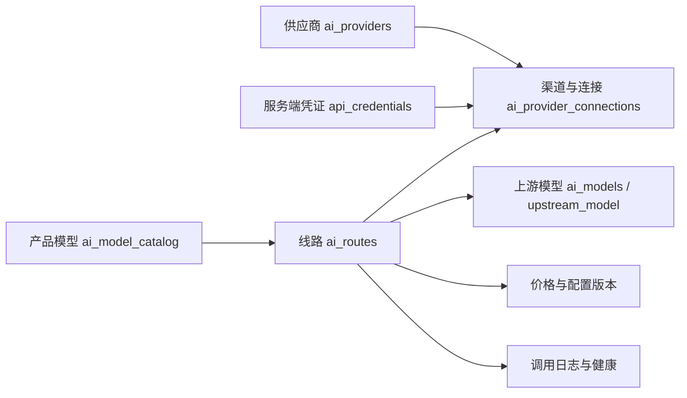
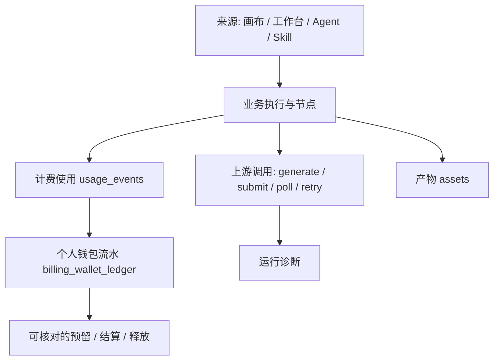

# TapFlow 管理后台升级计划：参考 New API 的产品与实施方案

> **For agentic workers:** 实施时按阶段拆分独立任务，使用 `subagent-driven-development` 或 `executing-plans`；以下复选框表示计划工作，不能当作已完成。本文是本次评审交付物，不代表已批准实施、迁移或部署。

> **实施状态更新（2026-09-21）：** 用户随后确认实施，代码工作在隔离分支 `codex/admin-console-v3` 中进行。该确认不代表已部署或已批准生产数据操作。P0–P2 正在集成与验证；P3–P7 尚未验收。进度与验证记录见根目录 `PROJECT_RECORD.md`。

**Goal:** 建立普通用户、平台运营管理员、超级管理员职责清楚的统一控制台，让用户查清每次生成与积分变化，让运营人员管理全站用户、任务、线路与渠道，让超级管理员控制权限、密钥、定价和支付。

**Architecture:** 保留 Vite/React、统一认证、现有 v2 API、个人钱包、Workflow/Worker、AI Gateway 和租户隔离。在同一个应用中增加个人中心与管理控制台的布局上下文，复用既有业务模块；先修权限和数据范围，再增加聚合查询、管理页面与运行观测。

**Tech Stack:** React 19、TypeScript、现有 TanStack React Query、共享菜单组件、Fastify、PostgreSQL/RLS、Redis/BullMQ、S3、现有 `packages/ai-gateway-core`。本计划不要求引入 New API 的 Go 服务、另一套认证或新的生产数据库。

**调研日期：** 2026-09-21。TapFlow 基线为本地 `10c4ec32` 加当前工作区内容；New API 参考固定于 2026-09-20 的提交。工作区存在其他未提交变更，未回退或合并进本任务。

**已确认的产品决定：** 用户选择“管理员 = 平台运营，管理全站普通用户、用量和线路；敏感配置由超级管理员控制”。团队管理员是另外一个租户内身份，不自动获得平台后台权限。

**调研边界：** 本次检查源码、迁移、项目记录、现有验收文档、用户截图与 New API 官方源码。没有登录生产环境，没有查询生产数据，没有操作真实用户、密钥、充值或供应商。以下“现状”表示源码证据；线上启用情况和历史数据完整度需要实施前基线核查。

**阅读顺序：** 产品决策先读第 1–6 节；页面与数据设计读第 7–10 节；排期、验收、上线读第 11–14 节。优先批准的边界是平台权限矩阵、个人/全站数据范围和首期交付范围。

---

## 1. 结论与推荐路线

当前后台的主要问题是管理入口、权限、数据口径和业务操作没有形成完整路径。用户管理、个人钱包、支付、模型线路、供应商连接、配置向导、巡检、工作流模板等基础已经存在，适合在现有系统内重组和补齐。

建议建设三个使用上下文：

1. **创作工作区：** 继续以项目、画布、工作台和素材为中心。
2. **个人中心：** 我的概览、使用明细、生成任务、个人钱包、充值订单、资料与安全。
3. **管理控制台：** 全站概览、用户、运行与用量、AI Gateway、资金、内容与系统管理；按管理员能力显示功能。

三者共享登录、用户上下文、API client、设计 tokens 和业务服务。这里的布局切换不意味着创建多个独立前端系统。

### 1.1 方案比较

| 方案 | 能解决的问题 | 成本与限制 | 判断 |
|---|---|---|---|
| A. 现有页面内增加 tab 和统计卡 | 很快补几个入口 | 保留跳转中转页、统计范围混乱和大页面耦合，后续继续难用 | 仅适合紧急修复 |
| B. 在 v2 应用内建设统一控制台 | 导航、权限、查询、管理操作和排障路径一起解决；保留现有运行系统 | 要新增聚合 API，分离平台角色，重组页面 | **推荐** |
| C. 引入或 fork New API 作为后台 | 可利用其网关产品能力 | 与现有用户、钱包、租户、Flow/Agent/资产体系形成双份事实源，需要复杂同步 | 不列为本轮路线 |

本文选择 B，同时把 A 中的确定问题放在第一阶段解决。

### 1.2 与旧计划的关系

- `docs/AI_GATEWAY_PLUGIN_DEVELOPMENT_PLAN.md` 的插件、模型、线路、连接、价格、测试发布方向继续有效。
- `docs/AI_GATEWAY_ADMIN_V2_FINAL_VERIFICATION.md` 记录的已完成建设不重复安排为“从零实现”。其中验收用例继续作为回归基础。
- 本计划新增的是整个控制台的信息架构、平台权限边界、个人与平台用量查询、任务和财务联查、统一管理体验。
- 历史 `CODEX_HANDOFF.md` 部分章节落后于现行代码；例如 `/admin` 已经挂载，账单已采用个人钱包。实施以核实后的代码和部署迁移状态为准。

## 2. 当前后台详细盘点

### 2.1 页面与角色

| 区域 | 当前入口 | 已有能力 | 本轮处理 |
|---|---|---|---|
| 创作入口 | `/home`、`/workspace`、`/workbench`、`/projects/:projectId`、`/assets` | 项目、画布、工作台、素材 | 保留主体验 |
| 个人账户 | `/account` | 身份、邮箱、工作区套餐等只读信息，账单与管理工具跳转 | 改为个人中心 |
| 个人钱包 | `/billing` | 可用/预留积分、到期信息、充值、兑换、账单明细 | 保留钱包服务，补历史查询与详情 |
| 运营管理 | `/admin` | 总览、用户、管理员、积分、公告、用量、模型/供应商中转、监控、支付、提示词等 11 个 tab | 拆成有独立地址的管理页面 |
| 模型中心 | `/account/ai-settings` | 产品模型、线路、默认、启停、复制、定价、测试，五步配置向导 | 迁入管理区，复用功能 |
| 供应商连接 | `/account/provider-settings` | 连接、Base URL、凭证轮换、关联线路 | 作为“渠道与连接”规范入口 |
| AI 接入初始化 | `/account/template-library` | 插件/模板初始化 | 改名，保持初始化用途 |
| 配置巡检 | `/account/inspection` | 线路、凭证、默认模型配置检查 | 纳入 Gateway 运维 |
| 工作流模板 | `/admin/templates` | 官方模板编辑、校验、版本发布 | 补主导航；与 AI 接入模板分开 |

当前前端角色规则在 `src/auth/productRoles.ts`：`system_admin` / `admin_email` 映射超级管理员；含 `admin:system` 的其他身份映射管理员；其余为创作者。这不是完整的平台 RBAC 模型。

### 2.2 已确认的体验与数据问题

| 优先级 | 问题与证据 | 对用户的影响 | 升级措施 |
|---|---|---|---|
| P0 | `AccountPage.tsx:63,149` 用 `admin:system` 显示全部管理工具；`AppRouter.tsx:140–177` 限制模型/连接/初始化为超级管理员 | 看到入口却被退回 | 菜单、路由、操作统一能力契约 |
| P0 | `AdminPage.tsx:316–350,718` 以最多 50 个用户搜索结果计算用户数、管理员数和积分；兑换码数也来自有限列表 | “总览”随搜索变化，误当全站数据 | 独立服务器聚合接口；展示范围与时间 |
| P0 | `admin.service.ts:596` 搜索全站用户；`:1588` 任务只允许当前租户；`:2091` 线路统计也仅当前租户 | 查到用户后看不到完整任务，线路健康不完整 | 明确 self / tenant / platform 查询范围 |
| P0 | `000030_admin_announcements.sql` 向 `tenant_admin` 授予 `admin:system`；AI 管理路由普遍检查该权限，而前端仅放行超级管理员 | 团队角色与平台权限混用，UI 限制不能代表 API 边界 | 独立平台授权，审计旧映射，不自动扩大权限 |
| P0 | `admin.service.ts:703` 的 grant-credits 与 `:796` 的 adjust-credits 使用不同的超级管理员判定 | 等价增加余额的操作权限不一致 | 所有资金写入口统一策略和幂等要求 |
| P1 | `BillingCenterPage.tsx:23` 只取 usage、ledger 各第一页；client 默认每页 20 条；表格无分页 | 普通用户无法完整追溯历史账单 | 服务器统一账单时间线、分页与筛选 |
| P1 | `/admin` 横向 tab + 模型/连接“跳转卡”；真正操作页在 `/account/*` | 不知道功能归属，返回路径不一致 | 固定分组侧栏、面包屑、详情深链 |
| P1 | `AdminPage.tsx:342` 多个模块的请求/状态耦合，用量只列最近任务和错误 JSON | 单个模块失败影响其他区域，排障困难 | 按页加载、独立错误态、任务详情联查 |
| P1 | `PaymentManagementPanel.tsx` 简单就地编辑，订单共用退款原因，缺少完整操作反馈 | 不易确认操作对应哪笔订单与是否成功 | 独立套餐、订单、退款详情与幂等状态 |
| P1 | `/account` 主要只读，会员显示来自工作区属性，钱包属于个人 | 个人、团队与付费权益归属不清 | UI 明确个人钱包与工作区会员，不暗中迁移权益 |
| P1 | 已有 `ai_call_logs`、`usage_events`、wallet ledger 和 workflow/node runs，但缺统一查询面 | 用户和客服无法一页解释一次生成 | 按关联标识建立查询模型 |
| P2 | `WorkspaceShell.tsx:193,409` 桌面 `lg:flex`、移动 `md:hidden` 的组合存在导航空档；帮助按钮无动作、钱包进度固定宽度 | 中等屏幕导航可能消失，信息不可信 | 浏览器复核后在布局阶段修复 |
| P2 | 初始化模板、工作流模板、模型、线路、供应商多种称呼交叉 | 概念学习成本高 | 固定术语与帮助文案 |

以上是静态分析结论，未表述为生产复现或已修复。权限项应在真实迁移状态下用三类测试账号验证。

### 2.3 必须复用的已完成基础

- 统一认证：`AuthProvider`、`AuthGate`、`v2HttpClient`、refresh/logout。
- 个人钱包：`billing_wallets`、`billing_wallet_ledger`、`PersonalWalletService`；当前普通用户汇总和流水按 `user_id`，用量按 `billed_user_id` 查询。
- 运行账务：reserve → enqueue/run → settle/refund；Worker 已调用个人钱包结算，不能退回旧 `billing_accounts` 作为个人余额来源。
- Gateway：`ai_providers`、`ai_models`、`ai_model_catalog`、`ai_provider_connections`、`api_credentials`、`ai_routes`、`model_pricing`、`ai_call_logs`。
- 已有配置 revision、模型向导、草稿、测试/发布、默认线路、复制、连接/密钥轮换。
- 已有用户状态/角色/会员/积分接口、兑换码、钱包支付、公告、运行查询、线路统计、health/metrics、audit。
- `ai_call_logs` 已有产品模型、线路、连接、适配器、上游模型等快照字段；先检查覆盖率，再补字段，不重复建一套日志。
- 模型密钥仅在服务端 CredentialVault；超级管理员也不获得读回明文密钥的页面。

## 3. New API 借鉴范围

参考基线为官方仓库提交 [`9a0be8750a6d736d9692535ed2cd68f8eec46529`](https://github.com/QuantumNous/new-api/commit/9a0be8750a6d736d9692535ed2cd68f8eec46529)。用户截图用于理解期望的信息层次；截图与当日 main 的导航并不完全一致。

| New API 中值得参考的设计 | TapFlow 的落地方式 | 参考依据 |
|---|---|---|
| 按使用场景分组的稳定侧栏 | 创作、个人中心、平台管理三个上下文；管理员菜单按能力出现 | [导航源码](https://github.com/QuantumNous/new-api/blob/9a0be8750a6d736d9692535ed2cd68f8eec46529/web/src/hooks/use-sidebar-data.ts) |
| 概览指标和趋势 | 积分、生成次数、成功率、耗时、队列、退款异常，点击卡片进入明细 | [概览卡片](https://github.com/QuantumNous/new-api/blob/9a0be8750a6d736d9692535ed2cd68f8eec46529/web/src/features/dashboard/components/overview/summary-cards.tsx) |
| 用户列表和动作 | 用户状态、个人钱包、工作区关系、最近活动、任务/账务联查 | [用户表格](https://github.com/QuantumNous/new-api/blob/9a0be8750a6d736d9692535ed2cd68f8eec46529/web/src/features/users/components/users-columns.tsx) |
| 渠道状态、测试和故障信息 | 连接健康、关联线路、影响模型、最近失败，操作分权 | [渠道表格](https://github.com/QuantumNous/new-api/blob/9a0be8750a6d736d9692535ed2cd68f8eec46529/web/src/features/channels/components/channels-columns.tsx) |
| 查询条件进入 URL | 时间、用户、模型、线路、请求 ID 等可复制、刷新、返回 | [日志筛选](https://github.com/QuantumNous/new-api/blob/9a0be8750a6d736d9692535ed2cd68f8eec46529/web/src/features/usage-logs/components/common-logs-filter-bar.tsx) |
| 使用日志与异步任务分开 | 一次用户生成、一次上游尝试、一次账务事件各有明细 | [任务日志](https://github.com/QuantumNous/new-api/blob/9a0be8750a6d736d9692535ed2cd68f8eec46529/web/src/features/usage-logs/components/columns/task-logs-columns.tsx) |
| 渠道 read/operate/write/sensitive_write 分权 | 查看、测试启停、线路编辑、敏感连接配置拆开；不采用明文密钥查看能力 | [权限定义](https://github.com/QuantumNous/new-api/blob/9a0be8750a6d736d9692535ed2cd68f8eec46529/service/authz/resources_channel.go) |
| 独立管理操作审计 | 操作者、授权范围、对象、结果、脱敏差异、请求关联 | [审计模型](https://github.com/QuantumNous/new-api/blob/9a0be8750a6d736d9692535ed2cd68f8eec46529/model/audit_log.go) |

本项目的用户主要在画布、工作台和 Agent 内创作。模型分销令牌、邀请返佣、模型部署市场、独立 MJ 控制台不是这次升级前置项；现有会员和充值继续保留，不以新增订阅系统拖慢首期。仅参考工作流与交互组织，自行实现当前项目组件。

## 4. 角色、权限与数据范围

### 4.1 平台身份与团队身份分开

建议新增全局 `platform_role_assignments`，存 `user_id`、`role_key`、`status`、`granted_by`、`revoked_by`、`reason`、`authz_version`、`created_at`、`revoked_at`，每个用户最多一个 active 平台角色，以部分唯一索引保证；内建 `platform_operator` 与 `platform_super_admin`。角色能力定义第一期在受版本控制的服务端策略中，不先建设任意 RBAC 编辑器。

该表没有 `tenant_id` 的理由是：它描述全站管理授权，不归某个团队。必须在迁移中记录这个例外，并以专用 RLS/受限访问防止普通用户读写。现有 `tenant_memberships` 继续管理团队内的 owner/admin/developer 等角色。

- `tenant_admin` 不自动成为平台运营管理员。
- 已有 `system_admin`、`admin_email` 先生成迁移核对清单，再由已验证的平台负责人明确映射；不得把全部旧 `admin:system` 用户自动升为平台管理员。
- 邮箱名单仅作显式、受控引导/应急恢复来源；切换后不能每次登录自动提权，避免已撤销身份被重新提升。日常平台授权以数据库为准。
- 平台授权撤销、用户封禁后要使现有会话失效或在下一次敏感请求重新校验；前端缓存不是授权依据。
- 不允许管理员给自己提权；不能删除、封禁、撤销或降级最后一个有效超级管理员。该检查使用数据库事务锁/串行化约束，覆盖并发操作；运营操作普通用户时，目标身份校验与写入同事务，避免并发晋升后的越权修改。

### 4.2 建议权限矩阵

下表为目标权限，区别于当前实现；运营的写权限只作用于普通用户和已允许的资源。

| 操作 | 普通用户 | 平台运营管理员 | 超级管理员 |
|---|---|---|---|
| 我的概览/钱包/使用/任务 | 本人且有资源访问权 | 本人 + 管理入口 | 本人 + 管理入口 |
| 全站概览、用量、任务元数据 | 无 | 有 | 有 |
| 查询全站普通用户、工作区关系 | 无 | 有 | 有 |
| 暂停/恢复普通用户 | 无 | 有，原因必填并撤销会话 | 有 |
| 管理管理员或超级管理员 | 无 | 无 | 有，保护最后一个超级管理员 |
| 查看用户积分和订单状态 | 本人 | 有 | 有 |
| 手工赠送、扣减积分 | 无 | 首期无 | 有，经账务服务与审计 |
| 支付退款、支付凭证、套餐配置 | 无 | 查订单/登记问题 | 有 |
| 已有兑换码查询/停用 | 本人兑换 | 可查询脱敏信息及停用 | 创建、发放、查看发放信息、停用 |
| 模型、线路、连接健康查看 | 产品可用模型 | 有 | 有 |
| 测试、启停线路、切换已验证默认线路 | 无 | 有 | 有 |
| 编辑线路标签、绑定已批准连接/上游模型 | 无 | 有，需通过配置校验 | 有 |
| 新建渠道、改 Base URL、轮换密钥 | 无 | 无 | 有；密钥只写不读回 |
| 改价格、发布新产品模型 | 无 | 草稿/预览 | 有，验证后发布 |
| 公告/提示词/工作流模板日常运营 | 无 | 按内容能力开放 | 有 |
| 运行审计 | 无 | 可查看授权范围 | 有 |
| 权限、支付、敏感连接的管理审计 | 无 | 无或经过裁剪的相关记录 | 有 |
| 原始供应商密钥读回 | 无 | 无 | 无 |

运营管理用户的核心是搜索、状态、用量、任务和问题处理；不把“管理用户”默认等同于能改其余额、修改管理员密码或查看私有创作内容。

### 4.3 能力契约和服务端执行

建议能力示例：`console:access`、`analytics:read:platform`、`users:read:platform`、`users:operate:platform`、`runs:read:platform`、`usage:read:platform`、`routes:operate:platform`、`routes:write:platform`、`connections:read:platform`、`connections:sensitive-write:platform`、`wallet:adjust:platform`、`pricing:publish:platform`、`roles:manage:platform`。

服务端计算有效能力，通过现有 `/api/v2/auth/me` 扩展返回。前端同一能力注册表驱动菜单、路由和按钮；每个 API 再做动作 + 资源范围校验。第一期内建角色绑定固定能力，未来才考虑可自定义角色。

禁止为新运营角色笼统设置 `app.is_system_admin=true` 后任意访问数据库。新增受控的管理员事务入口，校验服务端身份后分别设置读统计、用户操作、线路操作等数据库上下文；新 RLS policy 逐表授权。旧系统管理员事务只用于确需系统权限的既有流程，不能因复用 helper 而扩大普通运营权限。

切换时显式撤销 `tenant_admin → admin:system` 的旧平台授权，替换旧路由/service 的 `system_admin/admin_email` 硬判定与邮箱自动追加权限。尤其迁移 20 中平台连接/凭证等 `tenant_id IS NULL OR current_tenant` 写策略，必须审计并替换为明确写权限；PostgreSQL permissive policies 会 OR 合并，单纯追加“更严格”的 policy 不能收紧原有策略。现有 Worker 和发布流程所需授权单独保留并验证。

### 4.4 三种数据范围

| 范围 | 强制约束 | 特别说明 |
|---|---|---|
| self | 钱包 `user_id = 当前用户`；消费 `billed_user_id = 当前用户` | 不依赖当前工作区筛选来决定钱包归属 |
| tenant | 有效成员关系 + 对应租户/项目权限 | 用于协作资源，不代表能查看其他成员个人钱包 |
| platform | 显式平台角色能力 + 对象限制 + 审计 | 前端传入 `scope=platform` 本身不产生权限 |

平台看板默认全站，可进一步过滤工作区。个人钱包可展示跨工作区本人消费；个人任务按实际发起者与项目访问权过滤。发起者和扣费对象必须分列：拥有账务查看权不自动拥有项目、提示词、产物的查看权。

## 5. 信息架构与规范路由

### 5.1 普通用户个人中心

| 菜单 | 规范地址（建议） | 默认内容 |
|---|---|---|
| 账户概览 | `/account` | 可用积分、冻结积分、近 7 日已结算消费、生成状态、最近活动 |
| 使用明细 | `/account/usage` | 何时、在哪个项目、用哪个产品模型、产出数量、实际扣费 |
| 生成任务 | `/account/tasks` | 执行状态、耗时、失败说明、可访问产物、回到项目 |
| 个人钱包 | `/billing` | 余额、积分批次/到期、充值、兑换、资金流水 |
| 充值订单 | `/billing/orders` | 本人订单、支付结果、退款状态 |
| 个人资料 | `/account/profile` | 显示名等可编辑资料；邮箱变更沿用验证流程 |
| 安全设置 | `/account/security` | 改密、会话管理，分期接入现有认证服务 |

管理员进入个人中心时看到自己的消费；进入管理控制台时才显示全站数据。范围切换以明确页面标题和标签体现，避免把全站积分误读成个人余额。

### 5.2 平台控制台导航

```text
管理控制台                         当前身份 / 全站范围 / 返回创作
├─ 概览                  /admin/overview
├─ 用户与权限
│  ├─ 用户管理           /admin/users
│  └─ 管理员与权限       /admin/access                 [超级管理员]
├─ 运行与用量
│  ├─ 使用明细           /admin/usage
│  ├─ 生成任务           /admin/tasks
│  └─ AI 调用日志        /admin/calls
├─ AI Gateway
│  ├─ 模型中心           /admin/models
│  ├─ 线路总览           /admin/routes
│  ├─ 渠道与连接         /admin/connections
│  ├─ 配置巡检           /admin/inspection
│  └─ 接入模板           /admin/integrations           [初始化]
├─ 资金管理
│  ├─ 积分钱包与流水     /admin/wallets
│  ├─ 支付订单           /admin/payments
│  ├─ 兑换码             /admin/redeem-codes
│  └─ 充值套餐           /admin/packages               [超级管理员]
├─ 内容运营
│  ├─ 公告               /admin/announcements
│  ├─ 提示词             /admin/prompts
│  └─ 工作流模板         /admin/templates
└─ 系统管理
   ├─ 服务状态           /admin/system/health
   ├─ 操作审计           /admin/audit
   └─ 系统设置           /admin/system/settings        [超级管理员]
```

导航分组可折叠，默认只展开当前分组；超级管理员不会因此同时看到十几个横向 tab。“系统设置”只容纳本轮确实可配置且有 API 的项目；部署环境变量、主密钥不伪装成网页中可编辑的设置。

### 5.3 地址兼容

| 旧入口 | 新入口 |
|---|---|
| `/admin` | `/admin/overview` |
| `/admin#users`、`#admins`、`#credits` | `/admin/users`、`/admin/access`、`/admin/wallets` |
| `/admin#usage`、`#monitor`、`#payments` | `/admin/usage`、`/admin/system/health`、`/admin/payments` |
| `/admin#models`、`#providers`、`#announcements`、`#prompt-library` | 对应新的 models/connections/announcements/prompts |
| `/account/ai-settings` | `/admin/models` |
| `/account/provider-settings` | `/admin/connections` |
| `/account/template-library` | `/admin/integrations` |
| `/account/inspection` | `/admin/inspection` |

兼容映射保存已有 `connection/provider/family/model/route` 等合法筛选参数；无权限时给明确的无权访问页面和返回入口。保留 `/admin/templates/:id`。不得修改历史画布中的 `route_key` 或产品模型 key 来适配新地址。

## 6. 产品模型、线路与渠道的清晰定义



- **产品模型：** 创作者选择的能力和名称，例如某个生图/视频模型；属于模型中心。
- **线路：** 同一产品模型的可执行配置，绑定连接、上游模型、api_mode、request_path 和价格；用户显示“线路一/线路二”等友好名称。
- **渠道与连接：** 一组可复用的供应商接入配置；用户说的“渠道管理”落到已有 `ai_provider_connections`，首期不新增平行 `channels` 表。
- **供应商：** 资源归属/协议和适配器描述，一个供应商可以有多个连接。
- **接入模板：** 帮助初始化这些资源，不承担日常维护。

“线路总览”是对模型中心同一份线路数据的全站运维视图。两处共用编辑器、服务和校验规则：模型中心从产品角度管理，线路总览按健康/连接/故障横向查找，不形成两个事实源。

新增接入路径：超级管理员创建连接和凭证 → 在模型中心复用既有向导配置线路/价格 → 有成本提示的测试 → 对该配置 revision 发布 → 画布目录可见。运营可对已发布线路做测试、启停与经过验证的默认切换。

“已批准连接/上游模型”具体指超级管理员发布的配置组合及其 revision 引用。运营只能选择该组合，或改标签等白名单字段；不能借 route CRUD、复制、向导、模板安装、metadata/requestConfig 直接写入 Base URL、credentialId、headers、apiMode、requestPath 或价格。执行配置变更递增 revision、作废旧测试，复用既有测试/发布门禁；字段级校验必须在服务端完成。

首期保留现有默认/备用路由语义。New API 式权重分流、自动熔断、自动重试只在后续阶段评估；不能只加权重表单而 Worker 不生效。异步图片/视频超时后先确认上游任务状态，避免盲目重发付费生成。

## 7. 页面规格与核心工作流

### 7.1 管理总览

顶部固定“全站/工作区筛选、时间范围、时区、数据更新时间”。默认最近 7 天；支持今天、24 小时、30 天和自定义。所有卡片和趋势使用相同 scope/filter，点击即带条件进入明细。

第一行：生成任务数、最终生成成功率、已结算积分、当前冻结积分。第二行：新增/活跃用户、排队任务、失败/超时、退款/结算异常。当前冻结余额是快照，不能标成“最近 7 天消费”。

下方模块：

- 任务量与结算积分趋势；图像/视频/文本分别显示数量单位。
- 产品模型消费分布、线路失败与耗时排行；按“调用次数”或“生成任务数”明确切换。
- 队列积压、最长等待、异常结算、连接故障待处理列表。
- 普通运营显示积分和订单运营指标；真实现金收入、退款金额、上游成本、估算毛利只对财务能力开放。

每个模块独立 loading/error/retry。没有数据与请求失败是不同状态；数据缺失、成本未知、历史未关联必须明确标识，不能画成零。

### 7.2 普通用户使用明细

默认列：时间、来源（画布/工作台/Agent/Skill）、项目、产品模型、友好线路、数量/规格、生成状态、实际扣费积分、耗时、详情。

筛选：时间、项目、来源、模态、模型、任务状态、扣费状态。用户不需要理解 provider、上游模型、adapter、Base URL。默认隐藏成本和供应商内部错误。

详情展示：该次生成的安全参数摘要、提交/排队/执行/结束时间、实际数量、计价规则快照、预留/结算/释放过程、可访问资产和项目链接、便于反馈的记录编号。默认不回显提示词、上传内容或原始请求体。

例如：“9 月 20 日，项目 A，模型 X，线路二，1024 尺寸 2 张；预留 12 积分，最终扣费 10 积分，剩余预留释放 2 积分。”这是展示规格示例，不代表该模型真实价格。若执行失败，显示最终扣费与释放状态，不能仅靠任务失败推测退款完成。

### 7.3 平台使用明细与 AI 调用日志

**使用明细**以收费单位/usage event 为主，并从任务索引补入尚未结算、失败且没有 usage event 的执行，标明行类型。不得通过把调用日志与 ledger 展开 JOIN 导致消费重复。

具体去重规则：已有 usage 的执行按唯一 usage ID 展示收费项；仅对没有 usage 的执行补一行 execution，占位行在 usage 出现后被替换而非保留双行。一个执行的多个收费项允许多行，但任务数仍按执行去重。Agent/Skill 纯编排父任务不计入生成任务总数，真正发起模型生成的子执行才计数。

管理员追加列：扣费用户、发起用户、工作区、渠道/连接、上游模型、计费版本、账务异常。用户字段可打开用户详情，模型/线路可打开对应管理详情。

**AI 调用日志**以一次实际上游请求为主，列出 operation（generate/submit/poll）、attempt、HTTP/标准错误码、耗时、内部 request/trace、上游 request/task ID。详情按执行分组，看见“提交成功 → 轮询多次 → 生成失败”的真实过程。

前置配置失败（无路由、凭证无效、价格缺失等）显示在任务/执行失败阶段；没有发出上游请求的事件不能计为上游请求失败。前置失败是否落调用表通过 `operation=preflight` 与 `upstream_request_sent=false` 显式区分。

默认列表不返回 request_summary/response_summary 的任意 JSON；详情使用服务端 allowlist 字段。普通运营看标准化故障信息与关联标识，敏感诊断只对有能力的身份开放，且仍不返回凭证和签名 URL。

### 7.4 生成任务中心

统一覆盖画布 Workflow、工作台 generation、Agent/Skill 触发的实际执行。第一层看业务任务，展开看节点/子任务，再展开看调用尝试，避免用户在几十条轮询日志中找结果。

详情时间线：已提交 → 等待依赖 → 排队 → 执行/等待上游 → 产物入库 → 结算 → 完成。状态分别展示执行、资产和账务，不让“上游成功”掩盖 S3 入库失败或结算失败。

动作边界：

- “回到项目”“打开素材”“查看扣费”均使用已有权限和 `assetId` 重新解析 URL。
- 首期运维以查询、定位和调用已有取消接口为主；只在当前状态允许时显示取消。
- “重试生成”不是通用修复按钮：新付费执行需估算、预留和幂等键；上游结果未知时先查询原任务。
- “重新同步结果”与“重新调用模型”分开；只补入库/结算时不得再次生成或再次扣费。
- Agent/Skill 功能标志关闭时不显示可执行管理入口；可显示已有历史记录，不在本轮擅自打开运行标志。

### 7.5 用户管理

列表：用户 ID、邮箱/显示名、状态、注册/最近登录、最近使用、个人钱包可用/冻结、本人累计消费、工作区数、平台角色。搜索、状态、时间、平台角色/工作区过滤与服务器分页。

详情固定六区：基本资料、工作区关系、使用明细、生成任务、个人钱包/订单、安全与操作历史。用户消费按 `billed_user_id` 统计，工作区总消费另外展示。

现有 `admin.service.ts:2194–2201` membership 使用统计仅按 tenant 聚合，在共享工作区不能当作该用户个人消费；本轮应明确纠正。旧 UI 默认取 `memberships[0]` 的操作，应改为显式选择工作区，避免修改错误成员关系。

平台运营可以暂停普通用户、恢复其访问和登记问题；不能改同级/上级账号。敏感资料变更遵循认证服务验证流程。密码重置应沿用既有验证/重置能力并撤销旧会话，不把显示临时密码作为默认客服路径。

### 7.6 模型中心、线路总览、渠道与连接

| 页面 | 列表核心字段 | 详情/动作 |
|---|---|---|
| 模型中心 | 产品名、模态、发布状态、默认线路、可用线路数、用户价格、最近测试 | 复用向导、线路子表、参数 schema、价格 revision、测试/发布 |
| 线路总览 | 产品模型、友好线路、连接、上游模型、启停、默认、最终成功率、请求可用率、P95、最后失败 | 联查调用、测试、启停、切换默认、复用编辑器 |
| 渠道与连接 | 名称、供应商/适配器、脱敏地址描述、凭证状态、关联线路数、健康、最近测试 | 非敏感概览、关联线路、调用；超级管理员编辑地址/轮换密钥 |
| 配置巡检 | 无默认、无有效价格、凭证缺失、配置 revision 未测试、无 adapter 等 | 按问题直达对应表单；不直接修改历史 |

连接停用前显示影响的模型、线路及默认路由。目标要求是已提交任务保留解析时非敏感配置快照/版本引用，新任务遵循新状态；当前部分 poll 路径会重新读取 route/connection，P5 必须核实并补齐这个行为，不能当作现成保证。密钥仍由服务端按引用取用，不复制进任务 JSON；密钥紧急撤销时，进行中任务进入明确的等待恢复/失败策略。测试通过的 revision 才能发布，不能使用旧测试结果发布已修改配置。

不支持余额查询的供应商显示“不支持/未配置”；不得把用户充值金额当作供应商余额。测试有可能实际消耗供应商额度，页面明确测试范围与费用性质，并与真实用户使用统计分开。

### 7.7 钱包、支付与内容运营

- 钱包流水与生成使用明细分开：充值、赠送、过期、冻结、结算、释放、调整各有语义。
- 调整积分仅调用服务器钱包服务，操作必须带 target user、原因、金额、幂等键。`grant-credits` 与 `adjust-credits` 统一权限：当前前者没有后者的超级管理员判定，属于 P0 收口项。
- 支付订单显示商户单号、用户、套餐快照、现金金额/币种、支付/退款状态、时间、关联入账；金额用元展示、服务端仍按原精确单位计算。
- 退款原因绑定单笔订单，按钮有独立处理中/失败/结果状态；重复点击和支付回调不重复退款/入账。已结算生成退款、释放预留、现金退款是不同操作。
- 充值套餐继续既有支付系统；本轮不重接支付供应商，也不重新定义已售权益。
- 公告、提示词和工作流模板复用已有编辑发布能力，接入统一侧栏；AI 接入模板保持单独命名。
- 管理操作审计支持时间、操作者、对象、动作、结果筛选。用户禁用、平台授权、连接修改、价格发布、积分调整、退款必须可追溯。

## 8. 用量、成本与统计契约

### 8.1 四层事实，不做一行日志一笔扣费的假设



一项业务执行可以对应多条调用、多个子执行和计费项；只有按当前计费服务规则结算的记录构成消费。Agent 父任务统计子执行时不得再次累加同一使用事件。

当前 `database-media-runtime.ts` 会记录提交和轮询成功，pending 提交也可被记作 succeeded；`cost_raw` 列虽然存在，当前日志 INSERT 并未完整写入成本。文本/媒体运行的前置路由/凭证解析也可能在日志 try/catch 之外。新看板必须先规范这些语义。

现有外层 runtime 一条日志也不一定对应一个物理请求：`packages/ai-gateway-core/src/ai-gateway.ts` 的批量图片生成可在一次调用内循环执行 adapter。请求级 attempt 必须在真实 provider request 边界插桩，关联父 execution；覆盖批量拆分、内部重试、多 providerTaskId 与流式请求。runtime 汇总不再混入物理请求次数。

### 8.2 指标字典

| 指标 | 定义与数据来源 |
|---|---|
| 生成任务数 | 按统一业务执行 ID 去重；默认按提交时间分桶，不包括每次 poll；按来源、模态可拆分 |
| 生成成功率 | 选定提交时间 cohort 中 `succeeded / (succeeded + failed + terminal_timed_out)`；仅已确认业务终态进入分母；取消、进行中、结果未知单列，展示分母与截止时间 |
| 上游请求数/可用率 | 实际发出的上游请求，generate/submit/poll 分开；请求成功仅表示协议调用成功 |
| 产品模型消费 | 对唯一已结算 usage/settle 关联汇总；不把 reserve 再计为消费；事后退款独立列示 |
| 当前冻结积分 | 钱包当前有效预留余额，属于时点数；不是窗口内 reserve 流水和 |
| 退款/释放 | 失败后的预留释放与结算后的退还分列；现金退款单独按支付账统计 |
| 输入/输出 token | 仅上游实际返回或有明确计量来源时统计，缺失为 null；poll 不补算 token |
| 图像/视频量 | 张数、视频秒数、任务数分别展示；不能把单位不同的数直接相加 |
| 排队/执行/端到端耗时 | 分别用提交/开始/结束时间；异步上游耗时与本地 poll latency 分开 |
| P95 | 原始或可合并分布计算；不可平均多个桶的 P95 得出总体 P95 |
| 上游成本 | 带币种、金额、来源、actual/estimated/unknown 状态；无来源不填 0 |
| 收入与毛利 | 充值现金流不等于生成收入；有可追溯积分兑换/成本快照时才提供明确标为估算的口径，否则只展示可核实数据 |

时间使用 UTC 存储，查询明确 IANA 时区和半开区间 `[from,to)`；前端与服务端使用同一个时区分桶。支付按 paid_at、退款按 refunded_at、消费按 settled_at、任务按 submitted_at；跨时间域的卡片标明口径，不强行对齐成同一笔数。

网络请求 timeout 与生成终态超时不同。`provider_result_unknown`、暂时 poll 失败、待 reconciliation 的任务不进入最终成功率分母，也不推断已退款；迟到成功或最终对账更新真实任务状态，查询以 asOf 显示当时可知结果。管理员测试/巡检默认从业务生成指标排除，单独计量其供应商消耗。

钱包与历史 `billable_cents` 字段的单位要在查询映射中统一核实，前端 DTO 使用明确 `credits`，现金用 minor units + currency；不能因字段含 cents 就推断为人民币分。金额用数据库精确数值/十进制定点处理，API 可传十进制字符串，避免浮点累计。

### 8.3 查询 DTO 建议

以下是新增查询边界示例，不是要求替换现有运行数据模型：

```ts
type ConsoleScope = "self" | "tenant" | "platform";
type UsageLine = {
  id: string;
  recordType: "execution" | "usage";
  sourceType: "workflow" | "workbench" | "agent" | "skill" | "direct_api" | "legacy_unknown";
  trafficClass: "user_generation" | "admin_test" | "health_probe" | "control_plane" | "unknown";
  sourceId: string | null;
  executionId: string | null;
  parentExecutionId: string | null;
  rootExecutionId: string | null;
  tenantId: string;
  actorUserId: string | null;
  billedUserId: string | null;
  projectId: string | null;
  workflowRunId: string | null;
  nodeRunId: string | null;
  generationId: string | null;
  productModelKey: string | null;
  productModelLabel: string | null;
  routeLabel: string | null;
  executionStatus: string;
  billingStatus: "unreserved" | "reserved" | "settled" | "released" | "refunded" | "unknown";
  reservedCredits: string | null;
  chargedCredits: string | null;
  returnedCredits: string | null;
  inputTokens: number | null;
  outputTokens: number | null;
  quantity: string | null;
  unit: string | null;
  createdAt: string;
  dataQuality: "complete" | "partial" | "legacy";
};
type PageResult<T> = {
  items: T[];
  nextCursor: string | null;
  hasMore: boolean;
  asOf: string;
  scope: ConsoleScope;
};
```

真正的个人 DTO 由独立 allowlist 投影，不直接返回上面所有内部 ID；管理 DTO 追加连接/错误等授权字段。`billingStatus` 是从真实 reservation/ledger 推导的展示枚举，不允许前端据此修改账务状态。

## 9. 服务端与数据库增量设计

### 9.1 API 清单

下列为规范建议；已有能力保留原接口兼容，新查询按页拆模块，避免扩大 `admin.service.ts` 巨型文件。

| API | 现有/增量 | 职责 |
|---|---|---|
| `GET /api/v2/auth/me` | 扩展 | 平台角色、能力、授权版本；保留现有 fields |
| `GET /api/v2/me/overview` | 新增 | 本人概览 |
| `GET /api/v2/me/usage-events`、`/:id` | 新增统一投影 | 本人用量和关联详情，兼容既有 billing/usage-events |
| `GET /api/v2/me/tasks`、`/:id` | 新增 | 本人可访问的统一任务查询 |
| `GET /api/v2/billing/activity` | 新增 | 服务器排序的统一个人账单时间线 |
| `GET /api/v2/billing/summary|ledger|usage-events` | 保留/增强 | 当前个人钱包权威数据；旧分页兼容 |
| `GET /api/v2/admin/overview` | 新增 | 真正全站聚合，不由列表长度推算 |
| `GET /api/v2/admin/users`、`/:id` | 扩展 | 分页、筛选、个人/工作区统计明确分开 |
| `GET /api/v2/admin/users/:id/usage-events|wallet-ledger|sessions` | 新增查询 | 用户维度联查；sessions 限安全能力 |
| `GET /api/v2/admin/usage-events`、`/:id` | 新增 | 全站/已授权租户用量 |
| `GET /api/v2/admin/tasks`、`/:id` | 新增投影 | workflow/workbench/Agent/Skill 聚合；旧 workflow-runs 保留 |
| `GET /api/v2/admin/ai/calls`、`/:id` | 新增 | 调用明细、attempt、operation、trace 查询 |
| `GET /api/v2/admin/ai/route-stats` | 扩展 | 显式 scope、时间、operation，区分请求和生成成功率 |
| `/api/v2/admin/ai/connections|models|routes|pricing` | 复用并收口授权 | 现有 CRUD、默认、复制和定价 |
| 既有 ai-model-configurations 草稿/发布接口、ai-route-tests 测试接口 | 分别复用 | 配置 revision、测试结果关联和发布门禁 |
| `GET /api/v2/admin/wallet-ledger` | 新增 | 跨用户资金查询，写操作仍由钱包服务执行 |
| `GET /api/v2/admin/audit/logs` | 新增平台投影 | 保留既有租户 `/api/v2/audit/logs` |
| `POST /api/v2/admin/access/assignments`、撤销接口 | 新增 | 仅超级管理员，独立平台身份 |
| `POST /api/v2/admin/exports`、`GET /:id` | 第二阶段新增 | 受权限约束的大数据导出 |

用户订单和支付管理直接适配既有 payment 模块；个人 profile/security 操作先核对现有 auth routes，再补缺口，禁止新建绕过邮箱验证的写接口。

### 9.2 查询与导出规则

- 新明细用 `(created_at,id)` 稳定游标排序，游标绑定筛选、scope、asOf；页大小默认 50，上限 100。
- 时间范围默认 7 天，交互查询最多 90 天；更长范围走异步导出。旧记录仍可按明确 ID 查询。
- 查询数据和统计分别返回，列表分页不得改变总体数字。URL 保存非敏感筛选，清除敏感正文、邮箱等不必要查询串暴露。
- 多表先按 execution/usage 聚合再关联钱包与调用，避免 3 次 poll × 2 条 ledger 变成 6 倍消费。
- 导出采用 CSV 首期即可；由服务器记录申请人、过滤条件、权限、字段模板、数量和状态。下载时重新鉴权，对象存储短期签名 URL 不落业务事实表；处理 CSV 公式注入。
- 个人只能导出本人安全字段，运营导出不含密钥、原始提示词、私有产物 URL。后台导出默认 24 小时后失效。
- React Query cache key 含身份、scope、tenant 和筛选；切换账号/权限撤销时清空，防止后台内容残留给后续用户。

### 9.3 复用与必要新增

| 数据 | 处理 |
|---|---|
| 现有 wallet/usage/ledger | 保留权威账务；扩展读模型，不复制余额 |
| `platform_role_assignments` | 新增全局授权记录，记录无 tenant 的理由和访问策略 |
| `ai_call_logs` | 增补关联/操作字段；复用已有模型/线路快照 |
| `usage_events` | 补齐计价 revision/快照、结算时间及来源关联中缺失部分 |
| 业务任务查询 | 首期用经过统一授权的来源 UNION/查询适配器；量大后再做可重建投影表 |
| 审计 | 优先扩展现有 `audit_logs`，增加范围与结果/脱敏差异；仅全局管理动作允许 platform scope，租户动作保留 tenant_id |
| 导出任务 | 新增 `console_export_jobs`：申请人、scope、tenant_id、筛选摘要、状态、结果 object key、过期时间；明确全局导出 tenant_id 为空的例外 |
| 聚合 | 首期带索引 SQL 聚合；达到性能门槛后新增每日/小时物化汇总，均可从事实重建，不反写账本 |

建议补的调用字段：`actor_user_id`、`billed_user_id`、`request_id`、`trace_id`、`source_type`、`source_id`、`traffic_class`、`generation_id`、`execution_id`、`parent_execution_id`、`root_execution_id`、`operation`、`attempt_no`、`provider_request_id`、`provider_task_id`、`started_at`、`finished_at`、`upstream_request_sent`。实施前逐项比对当前 migration/schema，已有字段不重复添加。父子关联必须来自真实调度链，历史无法恢复的 source/execution 允许 null/unknown。

operation 与最终任务状态分开；成本追加 currency/source/quality 及版本信息，未知成本允许 null。历史可靠外键能关联才回填；不靠“相近时间 + 同一个模型”猜测用户、扣费或 provider task ID。

### 9.4 索引、RLS 与性能

先用真实数量级的脱敏测试数据和 `EXPLAIN (ANALYZE, BUFFERS)` 验证查询。优先考虑时间/id、billed-user/time/id、connection/time/id、source/execution、trace 索引；已有 tenant/time 和 provider/time 索引复用，不给每个过滤组合都建索引。

新增 tenant 数据均带 tenant_id 和 RLS。钱包继续 user-based RLS；平台授权、平台审计/导出等例外单独注释。平台 SELECT 与平台写分离，使用非 owner、无 BYPASSRLS 的数据库角色验证；不能只用超级数据库账号跑测试证明隔离。

建议验收性能门槛：在记录了机器配置、100 万条调用日志、10 万条用量的 staging 基准下，常用筛选首屏 API P95 ≤ 1 秒、30 天概览 P95 ≤ 2 秒，控制台可交互 ≤ 2.5 秒；若未达标先优化查询，再决定聚合表。它们是目标而非当前实测结果。

读看板可短缓存 30–60 秒，展示更新时间；余额、退款结果、线路配置写后即时失效。不同权限/scope 的缓存必须隔离。大导出不阻塞生成队列，使用有并发上限的独立 BullMQ 队列。

高频调用明细建议热查询保留 90 天，超过范围可归档查询；具体删除须单独确定保留政策。本轮不删除历史账本、支付或审计记录。汇总回填按范围分批、有 watermark，可重复执行。

### 9.5 审计可靠性

当前部分操作使用提交后的 best-effort `safeRecordAuditLog`。平台授权、资金操作、敏感连接与价格发布升级时，审计应在同一数据库事务落库，或通过同事务 outbox 可靠送达，不能业务成功而审计静默丢失。

审计保存操作者、当时角色/能力、目标用户/资源、scope/tenant、动作、结果、原因、request/trace、允许字段的前后差异。密码、凭证、Authorization、原始请求/响应、签名 URL 不进入审计；凭证变更只记“已轮换”和凭证 ID。

## 10. UI 与交互标准

参考截图的稳定侧栏、顶部指标和清晰表格，保留 TapFlow 品牌与现有主题。首期集中解决层级、密度和任务路径，不同时重做整站主题。

- 管理侧栏建议宽 224px，可折叠；顶部 56px，主区随屏幕伸缩。二级导航属于同一个 AppRouter/WorkspaceShell 的布局上下文。
- 页面统一“标题/说明 → 常用筛选 → 指标或表格 → 分页”；主要动作固定位置，高级筛选收起。
- 表格默认展示 8–10 个核心字段，更多字段可选择；ID 可复制，状态必须有文字，长错误不挤占列表。
- 详情有规范 URL，桌面可表现为抽屉；刷新或直接访问能打开完整详情，返回保留查询条件。
- 菜单严格复用 `MenuSurface`、`MenuSelect`、`useDismissibleLayer`、`menuStyles.ts`：行高 38px、主文字 12px/700、副文字 9px、共享间距与 z-index。不引入原生 select 或另造菜单密度。
- Escape/外点关闭、键盘焦点、表单错误定位、危险操作对象和影响范围、提交 pending 状态统一处理。
- 列表 query 与分页进入 URL；仅展示偏好可以使用非权威的客户端偏好，业务数据与画布/资产不转存 localStorage。
- 在 390、768、1024、1440、1920 宽度验证。小屏收起侧栏，详情全屏，表格按优先级降列或横向滚动。

页面结构示意：

```text
┌ 管理控制台 ────────────────────────── 全站 · 近7天 · 更新时间 ┐
│ 分组侧栏     概览 / 运行与用量 / 使用明细                     │
│             时间  用户  项目  模型  线路  状态     查询 导出  │
│             本期生成   已结算积分   最终成功率   平均耗时    │
│             ───────────────────────────────────────────── │
│             时间  用户  来源  产品模型  状态  扣费  详情     │
│             ……                                             │
│             每页50条                             上页 下页 │
└────────────────────────────────────────────────────────────┘
```

## 11. 实施拆分与工作量

预计完整核心范围 **29–45 个工程人日**，包含开发、相关测试和 staging 验收，不包括等待外部支付/供应商支持。单工程师约 6–9 周；两名熟悉仓库的工程师配合 QA，参考 4–6 周，不能简单将全部工期除二。阶段 0 的实际基线、日志量和权限迁移复杂度会影响估算。

依赖顺序：P0 → P1；P2 可在权限契约确定后与 P3 并行；P4 依赖 P3 查询；P5 可与 P4 并行；P6 依赖 P1 和账务投影；P7 为上线门槛。每阶段都是可演示切片，未完成能力不显示虚假按钮。

### P0 — 基线核对与确定问题收口（1–2 人日）

**文件：** `src/account/AccountPage.tsx`、`src/auth/productRoles.ts`、`src/admin/AdminPage.tsx`、`apps/api/src/modules/admin/admin.service.ts`；新增 `docs/ADMIN_CONSOLE_BASELINE.md`。

- [ ] 记录当前部署 commit、迁移 ledger、钱包切换状态、DB 连接角色/RLS 行为、三类账号的有效权限，不记录真实密钥。
- [ ] 列出旧 `admin:system` 来源和实际业务负责人，形成平台角色迁移清单；不自动晋升全部 tenant_admin。
- [ ] 统一账户入口与路由的现行访问判定；在全量聚合 API 上线前把有限列表指标准确标成“当前结果”，不继续称全站总数。
- [ ] 确认赠送积分与调整积分使用同一敏感权限；覆盖 `grant-credits` 等所有等价路径。
- [ ] 记录现有测试基线及数据库跳过项；区分原有失败和本轮回归。

**验收：** 运营不再看到点开即退回的入口；超过 50 个用户也不会被报告为全站只有 50 人；所有赠送/扣减路径的授权一致。涉及权限修复必须有 API 负向测试。

### P1 — 平台权限和范围（4–6 人日）

**现有文件：** `apps/api/src/modules/auth/permission-resolver.ts`、`auth.service.ts`、`apps/api/src/http/auth-middleware.ts`、`request-context.ts`、`apps/api/src/modules/admin/admin.routes.ts`、`ai-gateway/ai-gateway.routes.ts`、`src/auth/productRoles.ts`、`src/auth/AuthProvider.tsx`。

**建议新增：** `apps/api/src/modules/platform-access/platform-access.policy.ts`、`.service.ts`、`.routes.ts`、`.schemas.ts`；`packages/db/src/platform-access.ts`；`src/auth/consoleCapabilities.ts`；平台角色/RLS 迁移。

- [ ] 先补“普通用户/团队管理员/运营/超级管理员 × 本人/其他用户/其他租户 × 读/写”的失败测试。
- [ ] 新增全局平台授权和有效能力计算；全局身份不依赖当前选中的 tenant。
- [ ] 平台 API 使用 `requireAuth + platform capability`，全局查询不靠任意 tenant membership 兜底；tenant 对象操作仍校验 tenant 和资源关系。
- [ ] 收口旧 admin、Gateway、支付、凭证、模型发布、grant/adjust 的全部等价入口，不能只保护新路由。
- [ ] 增加授权撤销/封禁的会话失效、最后超级管理员保护、敏感变更可靠审计。
- [ ] 在非 BYPASSRLS 数据库角色下验证新读写策略；导出/后台 job 的授权也走同一边界。

**验收：** 运营跨租户查看普通用户/用量合法；团队管理员没有平台权限；运营调用密钥、支付配置、授权、积分增减返回 403；超级管理员合法操作成功且有审计。前端显示和直连 API 结果一致。

### P2 — 统一导航和管理布局（3–5 人日）

**现有文件：** `src/app/AppRouter.tsx`、`WorkspaceShell.tsx`、`routes.ts`、`src/admin/AdminPage.tsx`、`src/account/AccountPage.tsx`、现有模型/连接/模板/巡检页面。

**建议新增：** `src/console/ConsoleLayout.tsx`、`consoleNavigation.ts`、`legacyConsoleRedirects.ts`、`components/ConsoleTable.tsx`、`ConsoleFilters.tsx`、`ConsoleDetailPanel.tsx`、`ConsolePageState.tsx`。

- [ ] 增加同一认证壳内的个人/管理上下文，接入分组侧栏、返回创作、面包屑。
- [ ] 将现有可用管理页面挂到规范子路径，先复用现有组件；补官方工作流模板导航。
- [ ] 实现旧 URL/hash/合法参数的兼容映射，详情路径必须先于宽泛 `/admin/*` 匹配。
- [ ] 分页/筛选进入 URL，按页请求与加载；失败面板只影响自身。
- [ ] 所有菜单使用共享 tokens，补密度、层级、Escape/外点关闭回归。
- [ ] 复核并修复 768–1023px 导航空档；个人页与管理页均验证键盘和小屏体验。

**验收：** 三类身份可沿稳定导航完成现有操作；旧收藏链接可用；模型中心→连接→返回模型保留上下文；刷新和返回不丢筛选。此阶段不声称新统计已经可用。

### P3 — 调用关联、用量查询与真实聚合（6–9 人日）

**现有文件：** `packages/ai-gateway-core/src/database-media-runtime.ts`、`database-text-runtime.ts`、`apps/worker/src/workflow-runtime/service.ts`、`apps/worker/src/workbench/workbench-generation.service.ts`、`apps/api/src/modules/billing/billing.service.ts`、`apps/api/src/modules/admin/admin.service.ts`。

**建议新增：** `apps/api/src/modules/console-analytics/` 中独立 routes/schemas、`usage-query.service.ts`、`call-query.service.ts`、`task-query.service.ts`、`overview-query.service.ts`；`src/services/v2ConsoleApi.ts`；调用关联与必要索引迁移。

- [ ] 建立统计字典测试数据：一次视频提交、三次 poll、一次终态、一次扣费，任务数必须为 1；上游请求数与次数分别可解释。
- [ ] 检查真实写入路径和现有字段，在 provider request 边界增补 operation/source/trafficClass/actor/billed/trace/attempt，覆盖 adapter 内部重试与批量拆分，关联真实父子执行。
- [ ] 将前置失败与上游请求失败区分，保留最终执行状态与计费状态。
- [ ] 实现 self/tenant/platform 明细、详情和 keyset 分页；先按业务实体聚合再 join。
- [ ] 实现统一账单时间线，服务端决定完整排序；不再拼两份各 20 条的客户端列表。
- [ ] 实现真正的全站概览；按 billed_user 计算个人消费，单独定义工作区汇总。
- [ ] 分批回填可证明的旧关联，无法恢复的标记 legacy/partial，记录数量与原因。
- [ ] 使用现有 reserve/settle/refund 路径，不引入统计服务写余额；验证价格缺失仍返回 `PRICING_NOT_FOUND` 且不执行免费任务。

**验收：** 一次执行能联到用户、来源、调用、usage、钱包、资产；重试/轮询/父子任务不放大消费；跨租户个人查询仅返回本人授权数据；改模型名称/价格后历史记录仍解释得通。

### P4 — 个人中心、使用明细和用户详情（4–6 人日）

**现有文件：** `src/billing/BillingCenterPage.tsx`、`BillingActivityTable.tsx`、`billingApi.ts`、`billingActivity.ts`、`src/account/AccountPage.tsx`、`src/admin/adminApi.ts`。

**建议新增：** `src/account/usage/`、`src/account/tasks/`、`src/admin/users/`、`src/admin/usage/`、`src/admin/tasks/`、`src/admin/calls/`；每目录分列表、详情、查询状态和格式化职责。

- [ ] 普通用户可按日期/项目/模型查完整消费历史，打开扣费解释和生成结果。
- [ ] 新用户无数据、有预留未结算、失败已释放、历史缺失分别展示正确状态。
- [ ] 管理员可按用户/工作区查任务与账务，用户详情显式选择成员关系，不默认第一个 tenant。
- [ ] 上线任务时间线与调用 attempts 详情，增加从用户→失败任务→线路→账务的直接链接。
- [ ] 总览接真实聚合，所有卡片可下钻且筛选一致；单个接口失败不拖垮其他面板。

**验收：** 超过 20 条账单能翻页；客服可从一个记录编号在 3 次页面操作内定位任务、线路与扣费；普通用户看不到上游密钥、成本、原始诊断或他人资产。

### P5 — Gateway 日常运维完善（4–6 人日）

**现有文件：** `src/account/ai-settings/AiSettingsPage.tsx`、`ModelConfigurationWizard.tsx`、`src/account/ProviderSettingsPage.tsx`、`InspectionDashboardPage.tsx`、`src/services/v2AiGatewayAdminApi.ts`、`v2AiModelConfigurationsApi.ts`、对应 API modules。

**建议新增：** `src/admin/gateway/models/`、`routes/`、`connections/`；共享 `RouteEditor`、`ConnectionSummary`、`RouteHealthSummary`，逐步抽取现有功能。

- [ ] 固定产品模型/线路/连接的命名和列表字段，线路总览与模型中心复用同一编辑与服务。
- [ ] 配置巡检改用服务端聚合查询，减少逐模型 routes 请求；失败项直达具体配置。
- [ ] 运营可对已批准线路测试/启停/切默认，敏感连接和新模型发布由超级管理员控制。
- [ ] 连接停用显示影响范围；历史 route_key 和正在运行任务配置快照保持稳定。
- [ ] 真实请求可用率、最终生成成功率与 P95 各自标清；配置测试与用户调用分开统计。
- [ ] 完整回归草稿 revision → 测试 → 发布 → canvas picker → 真实生成/入库/结算。

**验收：** 新运营无需进入初始化模板就能管理既有线路；超级管理员能在清晰路径新增连接和上线模型；已保存画布路由可继续运行。

### P6 — 财务、内容与安全账户完善（4–6 人日）

**现有文件：** `src/admin/PaymentManagementPanel.tsx`、`src/billing/*`、`apps/api/src/modules/payments/*`、`packages/db/src/personal-wallet.ts`、`packages/db/src/audit.ts`、现有公告/提示词/模板与 auth 模块。

**建议新增：** `src/admin/payments/`、`wallets/`、`audit/`、`src/account/security/`、`profile/`；审计平台投影与必要 auth 查询。

- [ ] 拆订单与套餐页面，订单详情绑定退款原因与提交状态，服务端仍使用原支付幂等/对账流程。
- [ ] 用户钱包详情分页展示完整流水；积分变更、支付退款、预留释放使用不同动作与文案。
- [ ] 个人订单、资料、安全设置接真实接口；修改邮箱/密码和会话撤销使用既有认证规范。
- [ ] 现有内容运营迁入规范导航，继承发布、版本和权限校验。
- [ ] 管理操作审计可追溯前后差异和授权身份，不能删除资金历史来“修账”。

**验收：** 重复退款点击/回调不重复记账；运营无法调用敏感财务写接口；用户看到支付状态与钱包入账的真实关系；审计写入失败不能被敏感业务静默忽略。

### P7 — 导出、性能、迁移与上线（3–5 人日）

**建议新增：** `apps/api/src/modules/console-exports/`、`apps/worker/src/console-exports/`、相关队列注册/导出任务迁移；`docs/ADMIN_CONSOLE_V3_ACCEPTANCE.md`。

**现有文件：** `docker-compose.staging.yml`、`docs/STAGING_ENV_TEMPLATE.md`、`docs/staging-runbook.md`、`docs/PRODUCTION_RUNBOOK.md`、`PROJECT_RECORD.md`、`docs/CODEX_HANDOFF.md`。

- [ ] 异步导出、权限重新验证、限流/过期、CSV 安全处理；不阻塞生成任务队列。
- [ ] 用固定规模数据验证查询计划和性能目标；必要时补可重建聚合，不预先部署新分析数据库。
- [ ] 用三类平台身份和两个以上 tenant 完成浏览器验收，确认不能通过旧 URL/API 绕过新权限。
- [ ] 历史路由、资产、个人钱包、模型发布和计费回归通过后，按灰度范围上线。
- [ ] 记录回填覆盖率、不可恢复字段、上线指标、回退版本与管理账号恢复步骤。

**验收：** 本文第 12 节关键场景全部通过；没有依赖缺失而跳过的上线关键数据库测试；新旧入口过渡无双份余额/路由事实源。

### 首次可用版本与后续范围

P0–P2 即可交付入口清楚、权限一致的管理骨架并复用现有用户/模型/连接功能；P3–P5 完成用户要求的核心升级：真实明细、全站用户、任务、线路和渠道运维。P6–P7 完善运营闭环与上线质量。

后续独立立项：自动熔断和权重分流、可定制角色编辑器、经营利润模型、长期日志归档、外部 API Key 分销、邀请返佣。它们不进入本轮核心工期，不以“做全 New API 功能”作为验收标准。

## 12. 测试与验收清单

### 12.1 必须通过的业务场景

| 场景 | 期望结果 |
|---|---|
| 普通用户直接访问管理 URL/API | 页面无权访问；API 403，敏感数据不返回 |
| 团队管理员无平台授权 | 团队功能正常，全站后台不可用 |
| 运营切换当前工作区 | 平台权限不随 tenant 漂移；全站 scope 保持正确 |
| 运营直接调用旧凭证/定价/授权/赠送/调额 API | 与新入口相同权限限制，不存在旁路 |
| 运营利用 route metadata、复制、向导改 headers/地址/价格 | 服务端字段级拒绝；不能绕过敏感能力和 revision 门禁 |
| 两位超级管理员同时降级/撤销对方 | 事务约束保证至少一位有效超级管理员，审计记录结果 |
| 封禁/撤销授权后继续使用旧会话 | 新敏感请求被拒绝，UI 清理旧缓存 |
| 平台存在 80 个用户，搜索只命中 3 人 | 全站用户总数仍为 80，列表明确 3 个匹配结果 |
| 用户有 80 条账单，生成新记录同时翻页 | 稳定分页，完整排序，不重复/漏页；快照边界明确 |
| 一个用户加入两个工作区 | 钱包只有一个；消费归本人、工作区维度不重复加总 |
| 同工作区两个用户分别消费 | 用户 A 的累计消费不包含 B 的金额 |
| 视频 submit + 3 次 poll + 一次最终结果 | 任务量 1，上游调用量按操作分类，一次合法结算 |
| 批量图片生成内部分拆多个 provider request | 每个物理请求有 attempt 关联，runtime 汇总不重复加算 |
| 管理测试、巡检及未知上游结果 | 测试不混入业务成功率；结果未知单列，迟到结果按 asOf 更新 |
| 失败/取消/超时但上游结果未知 | 展示真实执行和资金状态，不自动声称已退款，不盲目重发 |
| 重复回调、重复 settle/refund、重复点击调整 | 幂等；账本不可变，无二次扣费/赠送 |
| 模型改名、线路停用、价格更新 | 历史用量显示当时快照；route_key 不变 |
| 父 Agent/Skill + 多个生成子任务 | 不重复累计子任务的 usage；关闭标志不启用新能力 |
| 上游成功而素材入库/结算失败 | 任务详情明确失败阶段，补偿不重复生成/扣费 |
| 价格缺失 | `PRICING_NOT_FOUND`，无免费执行 |
| 普通用户对无项目权限的财务记录 | 可看本人账务，不可打开他人画布、提示词或资产 |
| 旧记录缺少成本/关联 | 显示未知/历史不完整，不伪造 0 成本和成功率 |
| 只失败一个看板请求 | 其他模块正常显示，局部重试 |
| 新建连接、测试配置、发布产品模型 | revision 一致，画布可选，生成进入 assets 并结算 |
| 小屏、中屏、键盘、Escape/外点 | 导航可达，菜单不被遮挡，符合共享密度 |
| 导出后撤销申请人的权限 | 下载鉴权拒绝；导出内容不包含敏感字段 |

金额相关断言以 ledger/reservation 的业务语义核对，不简单把 reserve、settle、refund 的 amount 全部相加。先按 usage/execution 唯一关系计算，再对账到钱包服务。

### 12.2 命令与执行条件

每个实施切片先做对应失败用例，再做最小改动，检查相关回归。以下是最终门槛命令，不表示本次计划调研已经全部执行：

```bash
npm run build
npm run build --workspace @aigc-flow/db
npm run build --workspace @aigc-flow/ai-gateway-core
npm run build --workspace @aigc-flow/api
npm run build --workspace @aigc-flow/worker

npm test
npm run test --workspace @aigc-flow/api
npm run test --workspace @aigc-flow/worker
npm run test --workspace @aigc-flow/ai-gateway-core
npm run test --workspace @aigc-flow/db
git diff --check
```

已有重点回归文件：`src/admin/AdminPage.test.tsx`、`src/app/AppRouter.test.tsx`、`src/account/AccountPage.test.tsx`、`src/account/ai-settings/AiSettingsPage.test.tsx`、`src/account/ProviderSettingsPage.test.tsx`、`src/billing/BillingCenterPage.test.tsx`、`apps/api/test/admin.test.ts`、`apps/api/test/ai-gateway.test.ts`、`apps/api/test/ai-model-configurations.test.ts`、`packages/db/test/personal-wallet.test.ts`、`packages/db/test/admin-wallet-adjustment.test.ts`。

新增测试建议：`apps/api/test/platform-access.test.ts`、`console-usage.test.ts`、`console-calls.test.ts`、`console-analytics.test.ts`、`packages/db/test/platform-access-rls.test.ts`、`src/console/ConsoleLayout.test.tsx` 和个人使用明细/账单分页用例。测试围绕权限、金额、关联、历史兼容与可用交互，避免只断言组件实现细节。

本地基础设施使用 `infra/docker-compose.dev.yml`；如果 DB/Redis/S3 未运行，准确记录哪些测试被跳过。`docs/CODEX_HANDOFF.md` 中的历史失败只能作为定位线索，不能把新失败自动标成既有问题。生产上线前必须补齐真实 RLS、个人钱包、支付幂等与端到端生成测试。

## 13. 迁移、灰度与回退

### 13.1 数据和权限迁移

1. 保存迁移前 schema/授权清单和可恢复备份；对比实际迁移 ledger，不依据文件名最大序号推断生产状态。
2. 新 migration 使用执行时未占用的唯一版本号。仓库已有迁移编号冲突修复记录，本计划不预占一个可能被其他任务使用的数字。
3. 先新增表/可空字段/索引和兼容读取，再启用新写入；回填只补可靠关联，不改账务金额、不重新运行旧生成。
4. 将核实后的平台管理员映射到独立授权；验证至少一位超级管理员可登录，再撤销旧 tenant role 的平台能力映射。
5. 平台只读策略和操作策略分别验证，历史 Gateway 全局资源 `tenant_id IS NULL` 与租户私有资源都要覆盖。
6. 小范围启用新查询与页面，对照旧 wallet summary、真实 ledger、任务来源数据。旧页面保留兼容重定向，权限检查同时收口。

灰度建议先超级管理员，再少量运营，再个人中心。功能开关只控制新体验与查询切换，关闭 UI 开关不能恢复旧的过宽授权。若增加服务端环境变量，必须加入 Compose 的 `x-tapflow-env` 与 `docs/STAGING_ENV_TEMPLATE.md`；Vite 编译期变量还要按 Dockerfile 的构建注入路径设置，不能仅加入容器运行 env。

### 13.2 Docker Compose v2 上线顺序

以下为未来实施完成后的部署步骤。本次没有执行服务器部署。

```bash
cd /opt/aittco/tapflow
git fetch --all --prune
git pull --ff-only origin main

docker compose --env-file /opt/aittco/env/tapflow.staging.env -f docker-compose.staging.yml build
docker compose --env-file /opt/aittco/env/tapflow.staging.env -f docker-compose.staging.yml stop tapflow-worker
docker compose --env-file /opt/aittco/env/tapflow.staging.env -f docker-compose.staging.yml run --rm tapflow-api node packages/db/dist/cli.js
docker compose --env-file /opt/aittco/env/tapflow.staging.env -f docker-compose.staging.yml up -d tapflow-redis tapflow-api tapflow-worker tapflow-frontend
docker compose --env-file /opt/aittco/env/tapflow.staging.env -f docker-compose.staging.yml ps
docker compose --env-file /opt/aittco/env/tapflow.staging.env -f docker-compose.staging.yml logs --tail=100 tapflow-api tapflow-worker
```

迁移期间写入兼容必须事先验证；若涉及不兼容权限切换，使用受控维护窗口。迁移失败时不继续启动新 Worker。生产镜像迁移用编译后的 CLI，不依赖镜像内存在源 TypeScript。

上线冒烟：三类账号 → 本人/全站范围 → 查询历史 → 普通用户生成 → 冻结/成功结算/失败释放 → 资产打开 → 模型线路与连接 → 新旧入口授权 → 审计关联。

### 13.3 回退

- 优先切回已验证的页面/查询版本，或重新部署兼容新 schema 的前一 commit/image；记录回退目标。
- 新表和可空列可以保留，停止回填/聚合任务；不逆向重算已发生消费。
- 不回退到重新开放旧 `admin:system` 旁路的版本；必要时关闭相关管理写入口，保留修正后的授权层。
- 路由异常设为 inactive，保留历史；涉及 Worker 行为先停 Worker，再切换版本。
- 不通过删除账本、日志、用户或直接改余额来回退。数据库恢复仅在确需且有明确批准/备份时执行。

## 14. 本次交付与下一步

### 14.1 本次完成的内容

- 完成现有前端路由/菜单/角色/钱包/模型/支付、后端权限/查询/日志/账务、相关迁移与历史记录的源码调研。
- 核对 New API 官方固定提交中的导航、渠道、用户、用量筛选、任务日志、权限与审计设计。
- 输出三类身份、平台/租户边界、路由、页面、数据口径、API/DB 增量、实施阶段与验收/部署计划。
- 本地执行 `npm run build`，退出码 0。存在 Browserslist 数据过旧、CSS `task` 属性、静态/动态混合导入和大 chunk 提示；本次未修改相关业务代码。
- 文档无未填写占位项，代码围栏成对。全工作区 `git diff --check` 检出非本任务文件 `src/flowCanvas/agent/runtime/agentProtocol.ts` 的 EOF 空行；本次仅检查并维护两份文档，未修改该并行变更。
- 本次仅交付文档，不等同于完成新后台、生产权限修复或线上验收。后端测试、数据库 RLS 实测、真实登录 UI 验收未在本次调研执行。

### 14.2 实施开始前需要收集的具体数据

这些数据用于阶段 0，不阻碍本计划评审：实际部署 commit/迁移、管理员授权名单、用户和日志数量级、主要失败案例、历史调用字段覆盖率、会员归属规则、支付对账状态。收集只需统计和脱敏记录，不需要把密钥或数据库密码写入计划。

已确认管理员是全站运营角色。首期建议继续采用本计划内建能力矩阵，不先做任意角色编辑器；普通用户首页仍以创作为主。下一步应从 P0/P1 的权限和数据基线开始，再按 P2–P5 交付核心可用后台。
