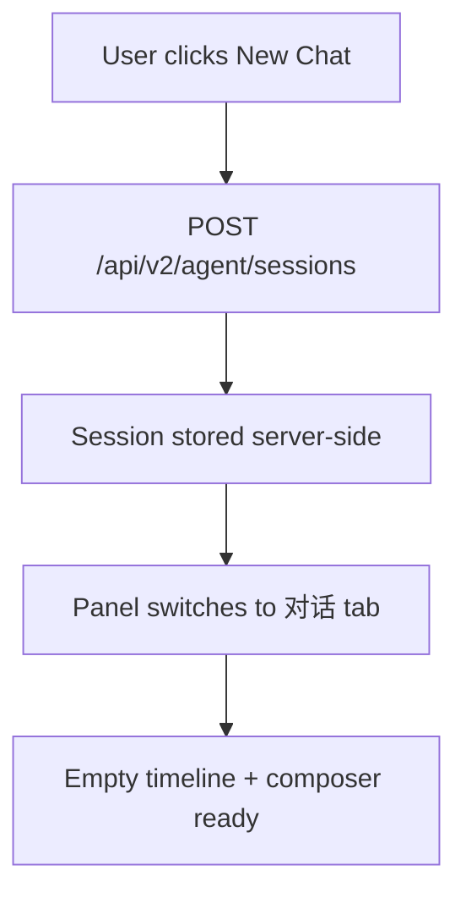
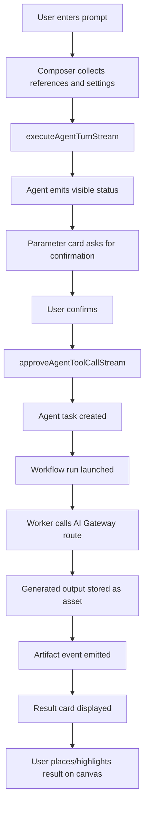
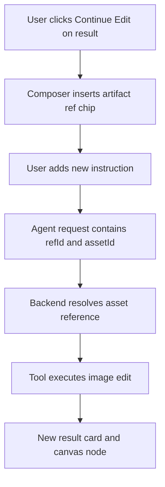

# Agent Workspace V2 Redesign Design

## 1. Summary

TapFlow Agent should be rebuilt as a right-side canvas production workspace, not patched as a floating debug-style chat panel.

The reference project `basketikun/infinite-canvas` is valuable because its Agent experience is organized around a complete production loop:

```txt
User prompt
-> selected canvas references / uploaded references
-> model and parameter selection
-> visible assistant progress
-> tool execution cards
-> generated result cards
-> insert / continue / variant actions on canvas
-> persistent conversation history
```

TapFlow should copy that product interaction model, but not copy its local-first persistence model. TapFlow must keep the v2 architecture:

- server-side Agent sessions and events
- server-side canvas drafts
- OSS-backed assets
- AI Gateway routes and pricing
- billing reserve / settle / refund
- provider credentials hidden from creator-facing UI

The target result is a production Agent that feels like a real canvas director: it can talk, read the canvas, accept references, expose model choices, run generation tools, show progress, place results on the canvas, and continue from prior outputs.

## 2. Reference Analysis

Reference repository:

- GitHub: `https://github.com/basketikun/infinite-canvas`
- Local inspected copy: `D:\infinite-canvas\infinite-canvas\infinite-canvas`

Key reference files inspected:

- `D:\infinite-canvas\infinite-canvas\infinite-canvas\web\src\app\(user)\canvas\components\canvas-assistant-panel.tsx`
- `D:\infinite-canvas\infinite-canvas\infinite-canvas\web\src\app\(user)\canvas\components\canvas-config-composer.tsx`
- `D:\infinite-canvas\infinite-canvas\infinite-canvas\web\src\components\model-picker.tsx`
- `D:\infinite-canvas\infinite-canvas\infinite-canvas\web\src\app\(user)\canvas\stores\use-canvas-store.ts`

Important behaviors to copy:

- Agent is a docked right-side panel, not a temporary modal or debug overlay.
- Panel supports resize and collapse.
- Header provides clear identity, new chat, history, settings, and collapse controls.
- Conversation and history are first-class surfaces.
- Composer is a production input area with prompt, mode switch, model picker, image settings, credits, and send action.
- Selected canvas nodes become visible reference chips.
- Image outputs appear inline in the conversation with insert-to-canvas actions.
- Generated outputs can be reused in later turns.
- The user sees an assistant working process instead of static text.

Important behaviors not to copy:

- Do not use localForage, IndexedDB, or browser local storage as authoritative storage.
- Do not store generated media as base64/data/blob URLs in canvas state.
- Do not expose raw model names, base URLs, provider keys, upstream model names, or credentials.
- Do not bypass TapFlow billing, workflow runs, worker execution, or OSS asset persistence.

## 3. Current TapFlow Agent Gaps

Current TapFlow Agent has strong backend foundations but weak product presentation.

Relevant current files:

- `D:\tapnow-flow\src\flowCanvas\agent\CanvasAgentPanel.tsx`
- `D:\tapnow-flow\src\flowCanvas\agent\CanvasAgentComposer.tsx`
- `D:\tapnow-flow\src\flowCanvas\agent\CanvasAgentThread.tsx`
- `D:\tapnow-flow\src\flowCanvas\agent\CanvasAgentToolTimeline.tsx`
- `D:\tapnow-flow\src\flowCanvas\agent\CanvasAgentParameterCard.tsx`
- `D:\tapnow-flow\src\flowCanvas\agent\useCanvasAgentSession.ts`
- `D:\tapnow-flow\apps\api\src\modules\agent\agent.routes.ts`
- `D:\tapnow-flow\apps\api\src\modules\agent\agent-executor.service.ts`
- `D:\tapnow-flow\apps\api\src\modules\agent\agent-tool-runner.ts`

Current issues:

- The panel still feels like an internal debug surface.
- User-facing copy exposes concepts such as runtime preview, replay events, tool timelines, and internal failure names.
- The UI splits one Agent turn across conversation, activity timeline, tool timeline, plan card, parameter card, and task cards.
- The user cannot see one clean production story from prompt to result.
- The composer lacks a reference/upload/model/settings/credit workflow similar to the reference project.
- History exists but is not a polished core Agent surface.
- Results can be placed on canvas, but they do not feel clearly tied to an Agent turn.
- The current UI can make the Agent look like it only creates nodes rather than finishing production work.

Backend capabilities to preserve:

- `agent_sessions`, `agent_messages`, `agent_turns`, `agent_tool_calls`, `agent_tasks`, `agent_task_events`
- event replay and SSE streaming
- real LLM executor path
- approval before paid generation
- image run settings and credit estimation
- durable task creation before generation
- generated asset refs and continuation context
- workflow-run and worker execution chain

## 4. Product Goal

Build `Agent Workspace V2`: a right-side production control panel for the canvas.

The user should experience Agent as:

```txt
I describe a production goal.
Agent reads my selected canvas materials.
I can choose model, line, size, quantity, and references.
Agent shows what it is doing.
Paid actions ask me to confirm parameters and credits.
Generated results appear in the conversation.
I can place results on canvas or continue from them.
My history is saved and usable across refreshes.
```

## 5. Non-Goals For This Redesign Slice

This redesign should not start by adding heavy end-state systems.

Deferred until the panel and core production loop are good:

- long-term memory
- MCP
- automatic model installation
- multi-agent role orchestration
- public plugin marketplace changes
- full video director UX beyond a placeholder-safe interface
- arbitrary canvas scripting exposed to the model

This slice focuses on the UI and interaction contract. It should reuse the current backend executor rather than replacing it.

## 6. Target UX Structure

### 6.1 Panel Shell

Agent should be mounted as a docked right panel inside the canvas workspace.

Required shell behaviors:

- fixed right-side docking
- width around `390px` by default
- min width `320px`
- max width around `720px`
- resize handle on the left edge
- collapse animation to the right
- reopen from the existing Agent button
- panel does not cover the canvas in a way that feels like a modal
- canvas remains usable while the panel is open

Header controls:

```txt
TapFlow Agent
Canvas Director
[new chat] [history/settings/log shortcut] [collapse]
```

The header must not show:

```txt
Director Runtime preview
Classic Agent
Replay Events
route_key
provider_key
upstream_model
baseUrl
internal adapter kind
```

### 6.2 Tabs

Use four tabs:

```txt
对话
历史
连接配置
日志
```

Tab responsibilities:

- `对话`: default production timeline and composer.
- `历史`: project/flow-scoped Agent sessions.
- `连接配置`: user-friendly availability and default model settings.
- `日志`: troubleshooting detail, collapsed away from normal users.

The `日志` tab is allowed to expose task status and user-safe error details. It must not expose provider credentials, raw base URLs, full authorization headers, or raw upstream payloads.

### 6.3 Empty State

When no conversation exists, show a calm branded empty state:

```txt
TapFlow Agent
One canvas, every production step

试试：
生成一张动物运动会海报
把选中的图片做成三张风格变体
基于刚才的结果继续做电商主图
```

No debug labels should appear in this state.

### 6.4 Conversation Timeline

The `对话` tab should show one unified timeline. It should not show separate disconnected sections for messages, activity, tools, and plans.

Timeline item types:

```ts
type AgentWorkspaceTimelineItem =
  | { kind: "message"; id: string; role: "user" | "assistant" | "system"; text: string; createdAt?: string; references?: AgentReferenceChip[] }
  | { kind: "status"; id: string; state: "queued" | "active" | "completed" | "failed"; title: string; detail?: string }
  | { kind: "parameter"; id: string; toolCallKey: string; models: AgentImageRunSettingsModel[]; referenceRefs?: string[] }
  | { kind: "tool"; id: string; toolCallKey: string; status: "awaiting_approval" | "running" | "succeeded" | "failed" | "cancelled"; title: string; summary: string }
  | { kind: "result"; id: string; toolCallKey: string; assets: AgentResultAsset[]; placedNodeIds?: string[] }
  | { kind: "error"; id: string; title: string; message: string; retryable: boolean };
```

This type is a frontend view model. It is derived from existing messages, event stream, activity timeline, and tool timeline state.

### 6.5 Progress Copy

User-facing progress should be written as production states:

```txt
正在理解需求
正在读取画布上下文
正在准备生成参数
等待你确认模型和积分
正在提交生成任务
正在等待模型返回结果
正在保存到素材库
正在放入画布
已完成
```

Avoid raw event labels:

```txt
thinking_status
tool_started
workflow_run_linked
artifact_created
turn_failed
```

### 6.6 Composer

The composer is the most important interaction surface.

Required controls:

- prompt textarea
- image upload / paste support
- selected canvas reference chips
- previous result reference chips
- mode switch: `对话`, `生图`, `图生图`
- model and line picker
- image parameter popover
- credit estimate
- send button
- disabled/running state

Initial modes:

```txt
对话: ask Agent questions or plan without immediate paid generation.
生图: generate from text and optional references.
图生图: edit selected/uploaded/previous image references.
```

Video mode should not be shown as a normal production option until the real video path is reliable.

### 6.7 Reference Chips

Reference chips come from three sources:

- selected canvas nodes
- uploaded/pasted images
- previous Agent result assets

Reference chips must show user-friendly labels:

```txt
选中图片 1
上传图片 1
上一轮结果 1
画布文本 1
```

Reference chips must pass stable IDs into the backend:

```txt
assetId
nodeId
agent artifact refId
upload token / newly created assetId
```

They must not pass raw OSS signed URLs, base64 data, blob URLs, or upstream prompt text as authoritative inputs.

### 6.8 Model And Route Display

The picker must show product-facing names only.

Allowed examples:

```txt
Nano Banana Pro 线路一
Nano Banana Pro 线路二
Nano Banana 2 线路一
GPT-Image-2 线路一
GPT-Image-2 线路二
```

Disallowed examples:

```txt
image.mouxihub.nano-banana-pro.t3
mouxihub-openai
https://api.mouxihub.com
gemini-3.1-flash-image-preview-4k
openai-compatible
```

Internally, `routeKey` may remain in state and API calls, but it must not be rendered in creator-facing copy.

### 6.9 Parameter Confirmation

Before a paid generation, Agent must show a confirmation card:

```txt
准备生成图片

模型：Nano Banana Pro
线路：线路二
画质：2K
比例：1:1
数量：1 张
预计消耗：8 积分

[修改参数] [确认生成]
```

If the user changes size, route, or quantity, credit estimate must update immediately.

### 6.10 Result Cards

Generated results appear inline in the conversation.

Result card actions:

- `放入画布`
- `继续编辑`
- `做变体`
- `做海报`
- `生成对比图`
- `查看素材`

If the asset is already placed on the canvas, show:

```txt
已放入画布
```

and allow highlighting the canvas node.

## 7. Frontend Architecture

### 7.1 Component Split

The current `CanvasAgentPanel.tsx` should stop owning every detail. It should become a shell/composition component.

New or refactored files:

```txt
src/flowCanvas/agent/CanvasAgentPanel.tsx
src/flowCanvas/agent/CanvasAgentWorkspaceShell.tsx
src/flowCanvas/agent/CanvasAgentTabs.tsx
src/flowCanvas/agent/CanvasAgentConversationView.tsx
src/flowCanvas/agent/CanvasAgentHistoryView.tsx
src/flowCanvas/agent/CanvasAgentConnectionView.tsx
src/flowCanvas/agent/CanvasAgentLogView.tsx
src/flowCanvas/agent/CanvasAgentComposer.tsx
src/flowCanvas/agent/CanvasAgentReferenceChips.tsx
src/flowCanvas/agent/CanvasAgentModelRoutePicker.tsx
src/flowCanvas/agent/CanvasAgentImageSettingsPopover.tsx
src/flowCanvas/agent/CanvasAgentTimeline.tsx
src/flowCanvas/agent/CanvasAgentTimelineItem.tsx
src/flowCanvas/agent/CanvasAgentResultCard.tsx
src/flowCanvas/agent/CanvasAgentWorkspaceTypes.ts
src/flowCanvas/agent/agentWorkspaceTimeline.ts
src/flowCanvas/agent/useAgentWorkspacePanel.ts
```

Existing files to reuse or adapt:

```txt
src/flowCanvas/agent/useCanvasAgentSession.ts
src/flowCanvas/agent/useAgentConversationHistory.ts
src/flowCanvas/agent/useAgentEventStream.ts
src/flowCanvas/agent/CanvasAgentParameterCard.tsx
src/flowCanvas/agent/CanvasAgentToolCard.tsx
src/flowCanvas/agent/agentRunSettings.ts
src/flowCanvas/agent/agentArtifactRefs.ts
src/flowCanvas/agent/canvasAgentApi.ts
src/flowCanvas/agent/canvasAgentOps.ts
```

### 7.2 Shell Ownership

`CanvasAgentPanel.tsx` should own:

- open/closed rendering
- session hook wiring
- tab state
- current session ID
- passing handlers into child components

It should not directly render:

- raw event lists
- raw tool timeline sections
- multiple separate task sections
- detailed composer internals

### 7.3 Timeline Adapter

Add `agentWorkspaceTimeline.ts` to convert current state into one timeline:

Inputs:

- `history.messages`
- `sessionActions.messages`
- `sessionActions.activityTimeline`
- `sessionActions.toolTimeline`
- `eventStream.events`
- `sessionActions.currentPlan`
- `sessionActions.error`

Output:

- sorted `AgentWorkspaceTimelineItem[]`

This lets the UI be rebuilt without replacing the executor.

### 7.4 Composer State

Composer state should include:

```ts
type AgentComposerState = {
  mode: "chat" | "text_to_image" | "image_to_image";
  prompt: string;
  selectedRouteKey: string | null;
  selectedSize: "1K" | "2K" | "4K";
  selectedAspectRatio: string;
  selectedQuantity: number;
  selectedQuality?: string;
  references: AgentReferenceChip[];
  estimatedCredits: number | null;
  estimating: boolean;
};
```

The composer should initialize route and size from:

1. current selected image node settings when available
2. active Agent session setting when available
3. server default image run setting

## 8. Backend And API Contract

The first implementation should reuse existing Agent APIs:

```txt
GET  /api/v2/agent/sessions
GET  /api/v2/agent/sessions/:sessionId/history
GET  /api/v2/agent/sessions/:sessionId/events
GET  /api/v2/agent/sessions/:sessionId/events/stream
GET  /api/v2/agent/run-settings/image
GET  /api/v2/agent/run-settings/image/estimate
POST /api/v2/agent/sessions
POST /api/v2/agent/sessions/:sessionId/turns/execute/stream
POST /api/v2/agent/sessions/:sessionId/tool-calls/approve/stream
```

Small API additions are allowed if needed:

```txt
PATCH  /api/v2/agent/sessions/:sessionId
DELETE /api/v2/agent/sessions/:sessionId
POST   /api/v2/agent/uploads/reference-image
```

Rules for new endpoints:

- require auth
- require tenant context
- use `/api/v2/*`
- do not return provider credentials
- return product-facing model names and route labels only
- store uploaded references as assets or short-lived server references, not frontend local blobs

## 9. Data Flow

### 9.1 New Conversation



### 9.2 Image Generation



### 9.3 Continuation From Previous Output



## 10. Error Handling

Error copy should be rewritten for users.

Examples:

```txt
模型线路暂时不可用，请换一条线路或稍后重试。
积分不足，无法开始这次生成。
生成任务失败，未消耗本次未结算积分。
参考图片读取失败，请重新选择或上传图片。
画布刚刚被更新，请刷新后再执行这一步。
```

Do not show raw backend error names unless inside the `日志` tab and still user-safe.

Disallowed normal UI copy:

```txt
PROVIDER_INTERNAL_ERROR
AGENT_PLANNER_INVALID_OUTPUT
turn_failed
No provider adapter is registered
adapter_kind=openai-compatible
route_key_snapshot=image.x.y
```

## 11. Testing Strategy

Frontend tests:

- panel dock/collapse/resize behavior
- tab switching
- history list scoped by project and flow
- composer reference chips from selected nodes
- composer upload/paste behavior
- model/route picker does not show route keys
- credit estimate updates on route/size/quantity changes
- unified timeline renders messages, status, parameter, tool, result, and error items
- generated result card actions call canvas placement/highlight handlers
- normal UI does not render debug/internal strings

Backend tests:

- run settings returns only user-facing display data
- estimate endpoint calculates selected settings
- Agent session history remains tenant scoped
- event replay returns ordered events
- tool approval accepts selected settings
- generated artifacts are linked to assets and tasks
- no provider secrets appear in API responses

Manual staging tests:

- open a project canvas
- open Agent panel
- create a new conversation
- generate one image with selected model, route, and size
- confirm credit estimate before generation
- see live progress within one second
- place result on canvas
- refresh page and verify history/replay
- continue from previous result
- verify no provider/baseUrl/route_key/upstream model appears in normal UI

## 12. Rollout Plan

Roll out behind the existing Director flag.

Recommended flags:

```txt
VITE_AGENT_DIRECTOR_ENABLED=true
AGENT_DIRECTOR_ENABLED=true
AGENT_EXECUTOR_ENABLED=true
AGENT_PLANNER_ENABLED=true
AGENT_PLANNER_FALLBACK_ENABLED=false
VITE_AGENT_OFFLINE_FALLBACK=false
```

Rollout stages:

1. Build new shell behind flag.
2. Make new shell consume existing session/executor hooks.
3. Replace debug timeline with unified timeline.
4. Replace composer with production composer.
5. Run staging with internal users.
6. Remove or hide old debug views from normal creator UI.

Rollback:

- disable the frontend and backend Agent flags
- redeploy current main
- keep existing session/task/event records
- do not delete historical Agent data

## 13. Acceptance Criteria

The redesign is accepted only when all criteria below are true:

- Agent opens as a stable docked right panel.
- Panel supports resize and collapse.
- User can create a new chat.
- User can switch to previous project/flow-scoped conversations.
- User can select or upload references.
- User can choose product model and line with friendly labels only.
- User can choose size, aspect ratio, and quantity before paid generation.
- Credit estimate updates before confirmation.
- Agent shows visible progress while working.
- Tool calls appear as friendly production cards.
- Generated images appear as result cards.
- Results can be placed on canvas or used for continuation.
- Refresh restores conversation, progress history, and result refs.
- Normal creator UI does not display provider names, base URLs, raw route keys, upstream model names, adapter kinds, or raw internal event names.
- `npm run build` passes.
- Relevant frontend and backend Agent tests pass.

## 14. Design Decision

Use the reference project as the UX model, not as the architecture model.

The correct TapFlow direction is:

```txt
infinite-canvas-style right Agent workspace
+ TapFlow server-side sessions/events/assets/billing/workflow execution
+ product-facing model and route names only
+ unified production timeline
+ reusable result references
```

This should replace the current debug-like Agent presentation. The executor work already done should remain, but it must be surfaced through a better panel, composer, timeline, and result system.
