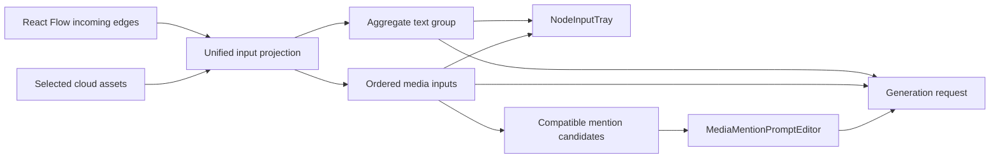

# Media Mentions and Unified Input Preview Design

Date: 2026-08-07
Status: Approved for implementation planning

## Objective

Extend the Scheme B unified node input projection so image and video generation nodes provide a predictable, LibTV-style input experience:

- Connected text nodes are represented by one aggregate card fixed before every media input.
- Image and video inputs expose useful hover previews.
- Image and video prompt editors share one reliable `@` media-reference workflow.
- Text nodes never appear as `@` candidates.

The implementation must preserve the v2 architecture: React Flow edges remain the connection model, `assetId` remains the authoritative media identity, and flow drafts must not persist transient media URLs.

## Confirmed Product Rules

### Text input group

When one or more upstream text nodes are connected, the first tray item is one aggregate text card. The card shows the text-source count. Hovering or opening it reveals each source node's title and a text excerpt in stable incoming-edge order.

The aggregate card is not draggable. Media items can be reordered only within the media region after the text group. Double-clicking an individual text entry focuses its source node. A user can remove one text source from the expanded list or remove the aggregate card to disconnect all upstream text sources.

Text inputs are also canonicalized before media inputs in persisted `inputOrder`. Their internal order follows the incoming edge order; reordering media cannot change that order.

### Media hover previews

Image and video cards retain compact thumbnails in the tray. Hovering a media card opens a body-level preview layer above all canvas nodes and toolbars. The layer chooses an above/below placement based on available viewport space and remains inside viewport bounds.

Image previews preserve the source aspect ratio within responsive maximum dimensions. Video previews show a poster immediately, then attempt muted inline playback after hover. Leaving the card pauses the video and resets it. If autoplay is unavailable, the poster remains visible. Missing or failed previews show an explicit fallback and retain the existing retry action.

The projected input model distinguishes thumbnail URLs from playable preview URLs. This prevents a video URL from being rendered through an image element. URLs remain runtime-only and are resolved again from `assetId` when required.

### Shared `@` media references

Image and video nodes use a shared `MediaMentionPromptEditor`. It owns prompt editing, IME handling, mention parsing, selection/caret restoration, keyboard navigation, reference-pill rendering, and invalid-reference presentation. Node-specific adapters own candidate discovery and graph/asset mutations.

Typing `@` opens candidates in this order:

1. Already connected media inputs.
2. Compatible canvas media nodes that are not connected yet.
3. Recently used compatible cloud assets.
4. Other compatible cloud assets.

Text nodes are excluded unconditionally. Image nodes normally offer image media, subject to the selected model's capabilities. Video nodes offer image, video, and, when the selected model supports it, audio media according to the active mode and route capabilities.

Choosing an already connected media item only inserts a mention. Choosing an unconnected canvas media node creates the edge before inserting the mention. Choosing a library asset adds the asset to the node's ordered inputs before inserting the mention.

Mention pills display localized labels such as `@图片1` and `@视频1`, but bind to a stable `inputKey`. Reordering media never changes which media object an existing pill references. Deleting a mention changes only the prompt; it does not remove an input, asset reference, or graph edge. Removing an input leaves its mention as visibly invalid plain text. Invalid mention text does not block generation and is sent as ordinary prompt text.

IME composition must not open, filter, or accept a mention candidate until composition has ended. The menu supports Arrow Up, Arrow Down, Enter, Escape, outside-click dismissal, and editor-focus restoration.

## Architecture

### Input projection

`canvasInputProjection` remains the canonical presentation projection. It exposes explicit text and media partitions and derives the final presentation sequence as one optional aggregate text group followed by ordered media items.

The projection keeps source node IDs, edge IDs, asset IDs, revisions, preview state, and media kind. Media seeds gain separate thumbnail and playable-preview fields. Safe signatures continue to depend on stable identifiers, revisions, roles, and order, never on temporary URLs.

### Store normalization

The flow canvas store centralizes input-order normalization. Connect, disconnect, reorder, and draft restore paths all apply the same invariant:

```txt
[upstream text keys in incoming-edge order] + [media keys in user order]
```

Media reorder actions receive media keys only. They cannot move an item ahead of the text group. Removing the text aggregate invokes a dedicated atomic action that removes every incoming text edge while preserving media edges and media order.

### Input tray components

`NodeInputTray` is divided into focused components:

- `TextInputGroupCard`: count, compact state, expanded source list, focus, single removal, and remove-all.
- `MediaInputCard`: thumbnail, role/order badge, drag/drop, focus, removal, retry, and hover trigger.
- `MediaHoverPreview`: portal positioning, image rendering, video playback lifecycle, fallback, and viewport constraints.

The tray keeps the existing compact canvas density and high-layer menu conventions. Expanded surfaces close on Escape, outside click, and mutually exclusive layer changes.

### Mention components

The current image-only prompt implementation is replaced by reusable boundaries:

- `MediaMentionPromptEditor`: shared editor state and rendering.
- `MediaMentionCandidateMenu`: shared menu and keyboard behavior.
- `MediaMentionReference`: stable reference identity, display label, kind, and optional runtime thumbnail.
- Image-node adapter: image-capability filtering and image input mutations.
- Video-node adapter: active-mode/model capability filtering and video input mutations.

Persisted mention metadata contains only stable keys, kinds, and labels. It must not contain signed URLs, object URLs, data URLs, base64 values, `File`, or `Blob` objects. The generation prompt remains a plain string for provider compatibility.

## Data Flow



The effective generation prompt continues to merge ordered upstream text with the node-local prompt. Ordered media references continue through the existing runtime and Worker request-building paths. Mention labels remain readable prompt text; stable mention bindings are canvas-editor metadata and do not expose provider credentials or runtime media URLs.

## Error and Compatibility Behavior

- Existing drafts without mention bindings are parsed best-effort from known labels and remain editable.
- Ambiguous legacy labels stay plain text rather than binding to the wrong media.
- Removing a bound input invalidates its pill visibly without silently rebinding it.
- Failed preview resolution leaves the input present and offers retry when supported.
- Video autoplay failure falls back to the poster without surfacing a generation error.
- Preview layers are keyboard dismissible and do not trap focus.
- Generation remains available when a mention is invalid because it is treated as prompt text.
- Canonical graph sanitization strips all transient preview and playback URLs before draft persistence.

## Testing and Acceptance

### Unit and component coverage

- Projection tests prove that multiple text inputs form one first-position group and retain incoming-edge order.
- Store tests prove that connect, restore, disconnect, and media reorder operations preserve the text-first invariant.
- Tray tests cover count display, expansion, source focus, single removal, remove-all, image hover preview, video hover playback, leave/reset behavior, fallback, and retry.
- Mention editor tests cover IME composition, query extraction, candidate ordering, keyboard selection, outside dismissal, stable binding, mention-only deletion, and invalid references.
- Image and video integration tests prove automatic edge creation for canvas candidates and ordered asset insertion for library candidates.
- Candidate tests prove that text nodes are never exposed and unsupported media kinds are filtered by node/model capabilities.
- Worker regressions prove that prompt merging and ordered media requests do not change when UI inputs are grouped.
- Canonical graph tests prove that mention metadata is safe and runtime preview URLs are absent from serialized drafts.

### Browser acceptance

A real Playwright smoke scenario covers desktop, tablet, and mobile viewports and verifies:

- The aggregate text card is first.
- Multiple text sources are visible in the expanded group.
- Image hover displays an image preview.
- Video hover uses a video element and resets on leave.
- Image and video prompts both open `@` candidates.
- Unconnected canvas media selection creates an edge.
- Asset selection creates an ordered input.
- Text nodes are absent from `@` candidates.
- Media reorder cannot cross the text group.
- No input tray, menu, or preview layer causes horizontal viewport overflow.

### Required verification

Run the focused frontend and Worker tests, the new Playwright smoke, `npm run build`, relevant workspace builds/tests, and `git diff --check`. Update `PROJECT_RECORD.md` with the completed behavior and exact verification evidence.

## Out of Scope

- A full structured prompt AST or provider request-format migration.
- Text-node `@` mentions.
- Persisting media bytes or temporary preview URLs in flow drafts.
- Redesigning unrelated image/video parameters or model-selection controls.
- Changing billing, route selection, or provider credential behavior.
